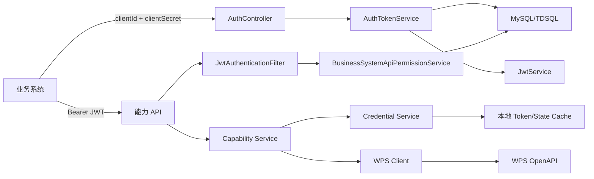

# 架构设计

## 总体架构

## 分层说明

| 层 | 包 | 职责 |
| --- | --- | --- |
| API 层 | `*.api` | HTTP 入参校验、响应包装、调用 application service。 |
| Application 层 | `*.application` | 编排业务流程，不直接暴露 HTTP 细节。 |
| Domain 层 | `*.domain` | 业务身份、凭证、结果等领域对象。 |
| Infrastructure 层 | `*.infrastructure` | 数据库、HTTP client、本地缓存、Filter、配置。 |
| Common | `common` | 统一响应、错误码、请求上下文、健康检查、安全响应头。 |

## 核心组件

| 组件 | 职责 |
| --- | --- |
| `GatewayRequestContextFilter` | 生成或继承 `X-Request-Id`，放入 `RequestContextHolder`。 |
| `JwtAuthenticationFilter` | 对能力 API 校验 Bearer JWT，并执行 API 权限检查。 |
| `CapabilityRoutePolicy` | 将 HTTP method + path 映射为 API code。 |
| `AuthTokenService` | 校验业务系统凭证，签发内部 JWT。 |
| `BusinessSystemApiPermissionService` | 校验业务系统状态、token 版本、权限版本和 API 权限。 |
| `UserAssertionVerifier` | 历史兼容组件；新 USER 主链路不再要求每次请求携带用户断言签名。 |
| `WpsCredentialService` | 获取和缓存 WPS app token。 |
| `WpsUserAuthorizationService` | 管理 WPS USER OAuth state 和 user token。 |
| `WpsHttpClient` | 创建预览链接和获取 WPS app token。 |
| `WpsFileHttpClient` | 使用 WPS user token 查询文件列表。 |
| `WpsAuthorizationHttpClient` | 生成 WPS 授权 URL，并用 OAuth code 换 user token。 |

## 请求上下文

请求上下文由 `RequestContext` 承载，主要字段包括：

| 字段 | 来源 | 用途 |
| --- | --- | --- |
| `requestId` | `X-Request-Id` 或服务端生成 | 日志、响应和排障关联。 |
| `businessSystemId` | JWT claim | 业务系统身份。 |
| `clientId` | JWT claim | 调用方 client。 |
| `identityType` | JWT claim | 当前 token 是 APP 还是 USER，用于路由身份校验。 |
| `userId` | USER JWT claim | USER 接口的当前操作用户。APP JWT 不携带该字段。 |
| `jti` | JWT claim | JWT 唯一标识。 |
| `tokenVersion` | JWT claim + 数据库 | token 失效控制。 |
| `permissionVersion` | JWT claim + 数据库 | 权限变更后旧 token 失效控制。 |
| `apiCode` | `CapabilityRoutePolicy` | 当前请求能力码。 |

## 数据存储

当前持久化数据包括：

- `biz_system`：业务系统接入配置和 client secret 摘要。
- `biz_system_api_permission`：业务系统拥有的 API 能力权限。

当前内存缓存包括：

- `LocalWpsTokenCache`：WPS app token。
- `LocalWpsUserTokenCache`：WPS user token，以 `userId` 维度缓存。
- `LocalOauthStateCache`：WPS USER 授权 state。
- `UserAssertionNonceCache`：历史用户断言 nonce 缓存，新 USER 主链路不再依赖。

生产多实例时，内存缓存需要替换为 Redis 或数据库。

## 依赖方向

代码约束由 `ArchitectureBoundaryTest` 覆盖，主要方向是 API 调用 Application，Application 依赖 Domain 和 Client 接口，Infrastructure 实现外部系统细节。WPS HTTP 细节集中在 `wpsclient.infrastructure`，能力服务依赖 `wpsclient.application` 接口。
