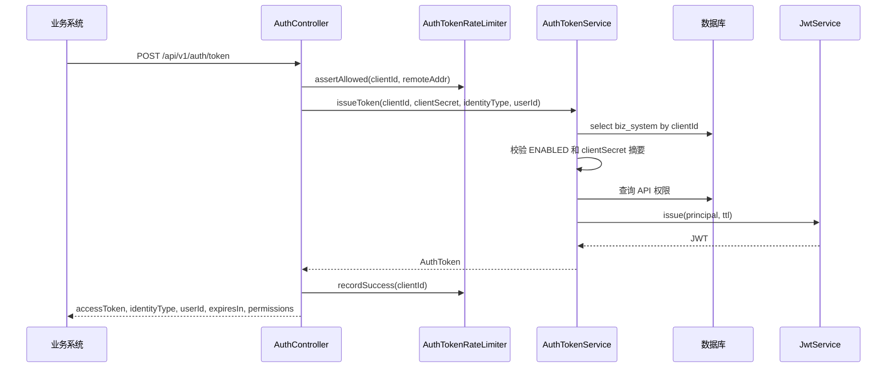
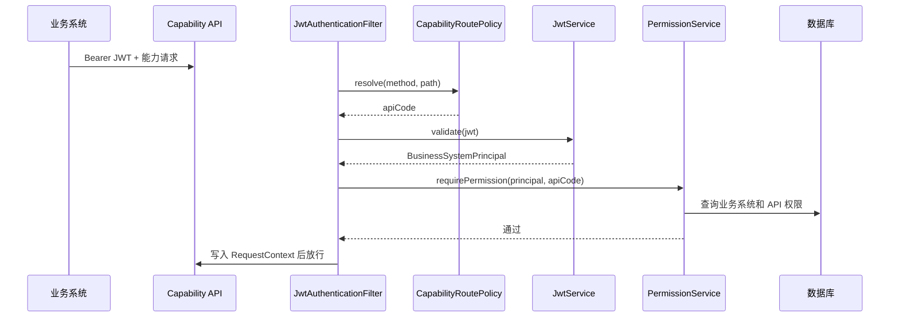
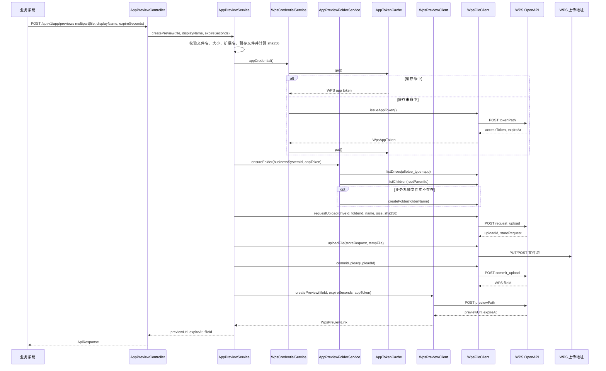
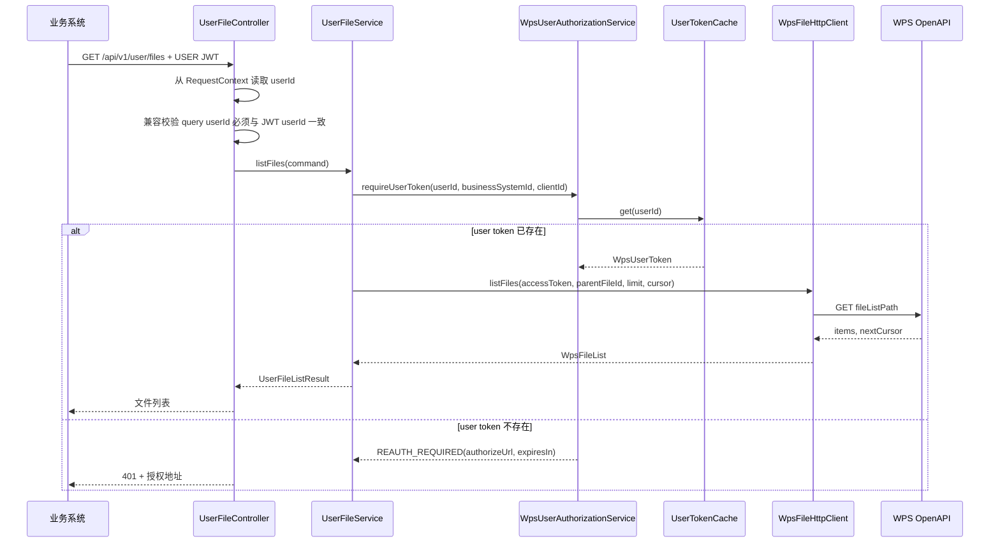
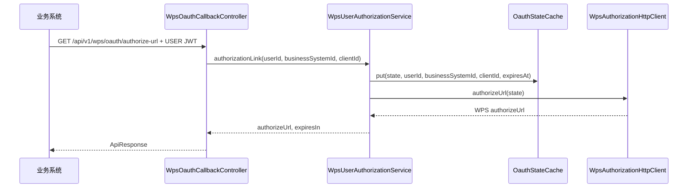
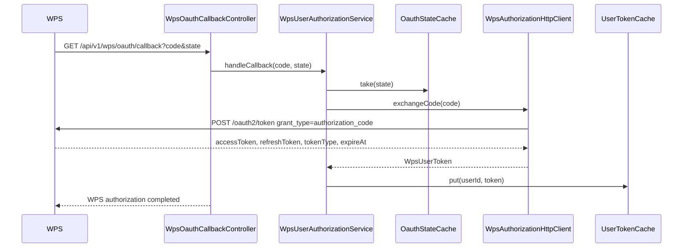

# 核心链路

## 业务系统换取内部 JWT

失败处理：

- `clientId/clientSecret` 错误返回 `TOKEN_INVALID`。
- `identityType` 不传时默认签发 APP JWT；传 `USER` 时必须带 `userId`。
- 业务系统禁用返回 `BUSINESS_SYSTEM_DISABLED`。
- 认证失败会进入应用层限流计数。
- 超过限流阈值返回 `RATE_LIMIT_EXCEEDED`。

## 能力 API 认证鉴权

鉴权检查包括：

- JWT 格式、签名、issuer、audience、typ、exp。
- 业务系统存在且状态为 `ENABLED`。
- JWT 中的 `tokenVersion` 等于数据库当前值。
- JWT 中的 `permissionVersion` 等于数据库当前值。
- 当前 API code 在权限表存在且状态为 `ENABLED`。
- 当前 API code 要求的 APP/USER 身份类型必须与 JWT 中的 `identityType` 一致。

## APP 文件预览

APP 文件预览不再要求业务系统提前提供 WPS `fileId`。服务端会使用 APP token 完成 WPS 应用盘发现、业务系统文件夹准备、三段式上传和预览链接创建。上传前会把文件暂存到受控临时文件，计算大小和 `sha256`，避免把完整文件一次性放进 Java 堆内存。

## USER 文件列表

USER 模式下业务系统需要先为当前业务用户换取 USER JWT。服务端只信任 JWT 中的 `userId`；query `userId` 是兼容字段，如果传入，必须与 JWT 中的 `userId` 一致。这样即使攻击者修改 URL 参数，也不能改变实际操作用户。

## WPS 用户授权链接

授权 `state` 绑定 `businessSystemId`、`clientId`、`userId` 和过期时间，并且在回调时一次性消费。

## WPS OAuth 回调

`state` 是一次性值，使用后从缓存移除。
