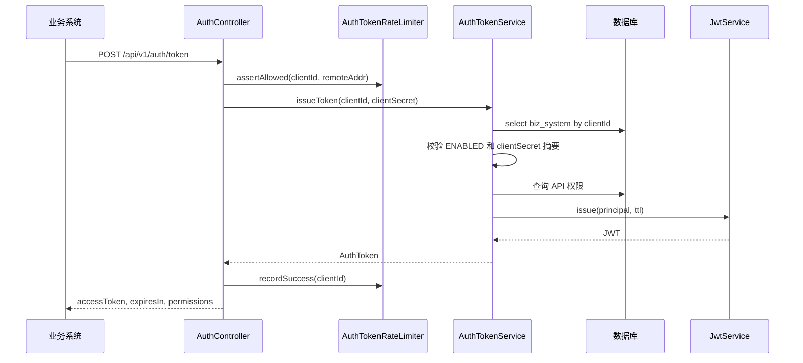
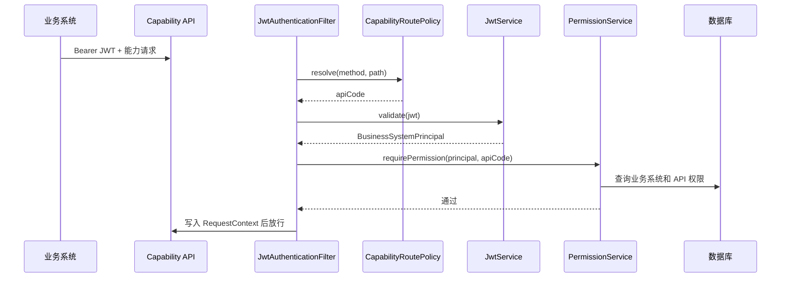
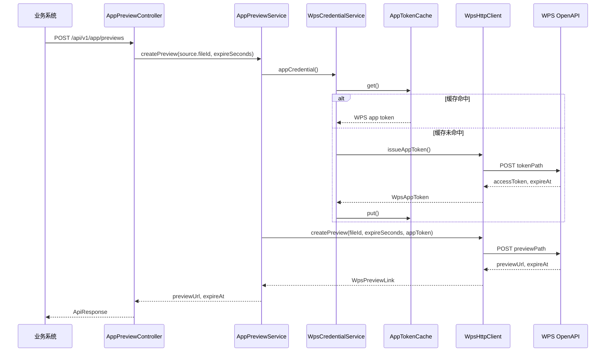
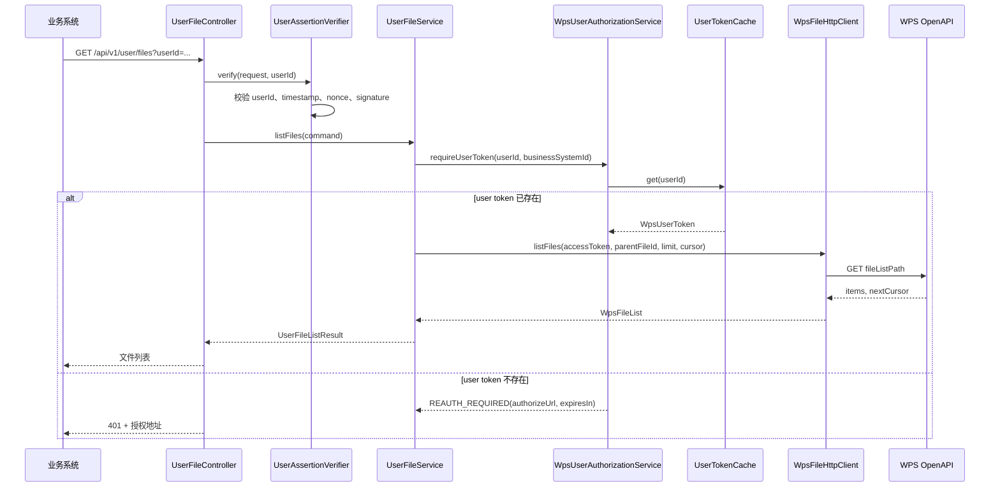
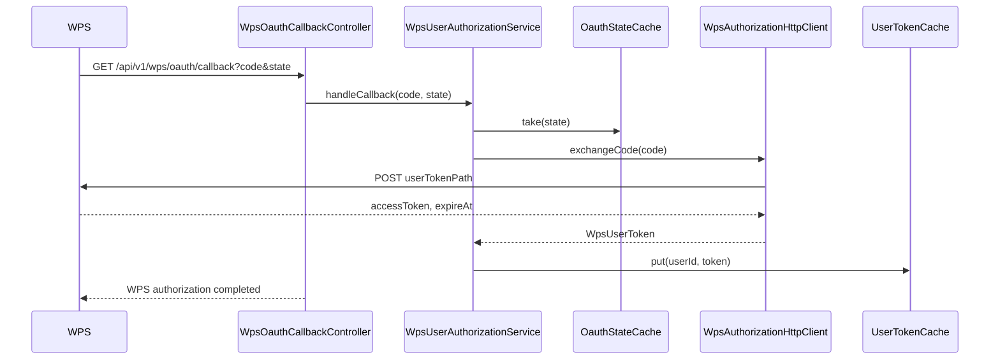

# 核心链路

## 业务系统换取内部 JWT

失败处理：

- `clientId/clientSecret` 错误返回 `TOKEN_INVALID`。
- 业务系统禁用返回 `BUSINESS_SYSTEM_DISABLED`。
- 认证失败会进入应用层限流计数。
- 超过限流阈值返回 `RATE_LIMIT_EXCEEDED`。

## 能力 API 认证鉴权

鉴权检查包括：

- JWT 格式、签名、issuer、audience、typ、exp。
- 业务系统存在且状态为 `ENABLED`。
- JWT 中的 `tokenVersion` 等于数据库当前值。
- JWT 中的 `permissionVersion` 等于数据库当前值。
- 当前 API code 在权限表存在且状态为 `ENABLED`。

## APP 文件预览

当前实现只支持 `source.type = WPS_FILE`，也就是入参 `fileId` 已经是 WPS 文件标识。直接接收业务系统文件流并上传到 WPS 后预览尚未实现。

## USER 文件列表

USER 模式下业务系统不能只传一个 `userId` 参数，还必须用共享签名密钥对请求上下文签名。这样即使攻击者拿到业务 JWT，也不能随意替换 `userId` 调用其他用户。

## WPS OAuth 回调

`state` 是一次性值，使用后从缓存移除。
