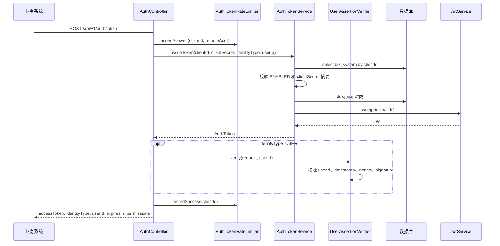
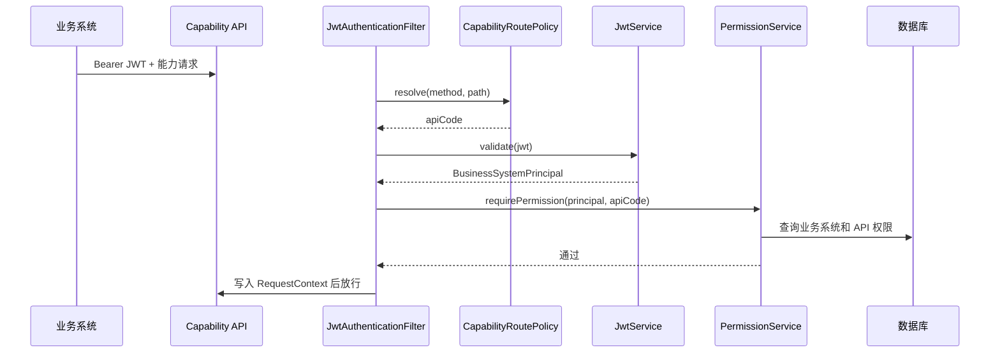
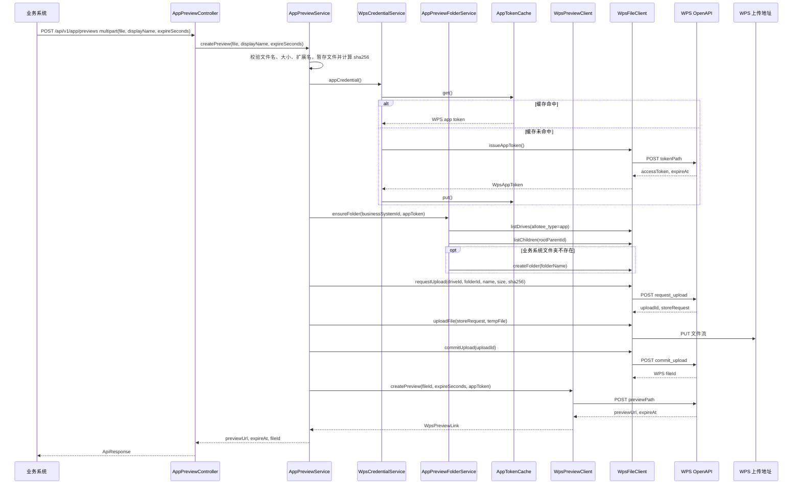
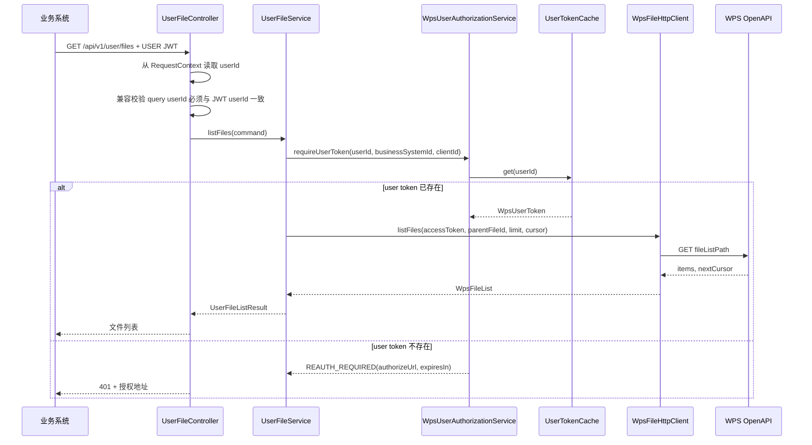
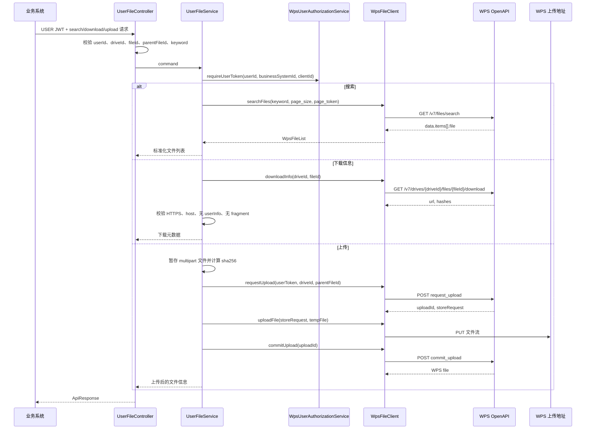
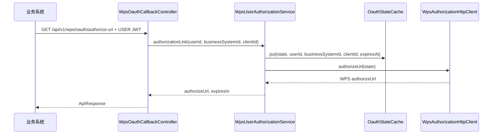
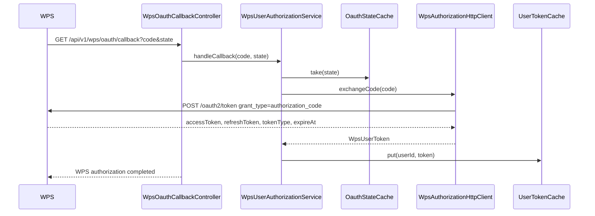

# 核心链路

## 业务系统换取内部 JWT

```mermaid
sequenceDiagram
    participant B as 业务系统
    participant A as AuthController
    participant L as AuthTokenRateLimiter
    participant S as AuthTokenService
    participant U as UserAssertionVerifier
    participant D as 数据库
    participant J as JwtService

    B->>A: POST /api/v1/auth/token
    A->>L: assertAllowed(clientId, remoteAddr)
    A->>S: issueToken(clientId, clientSecret, identityType, userId)
    S->>D: select biz_system by clientId
    S->>S: 校验 ENABLED 和 clientSecret 摘要
    S->>D: 查询 API 权限
    S->>J: issue(principal, ttl)
    J-->>S: JWT
    S-->>A: AuthToken
    opt identityType=USER
        A->>U: verify(request, userId)
        U->>U: 校验 userId、timestamp、nonce、signature
    end
    A->>L: recordSuccess(clientId)
    A-->>B: accessToken, identityType, userId, expiresIn, permissions
```

失败处理：

- `clientId/clientSecret` 错误返回 `TOKEN_INVALID`。
- `identityType` 不传时默认签发 APP JWT；传 `USER` 时必须带 `userId`。
- `identityType=USER` 时必须携带用户断言请求头：`X-Yundoc-User-Id`、`X-Yundoc-User-Timestamp`、`X-Yundoc-User-Nonce`、`X-Yundoc-User-Signature`。
- USER 断言签名绑定请求方法、路径、query、`businessSystemId`、`clientId`、`userId`、时间戳和 nonce。
- 业务系统禁用返回 `BUSINESS_SYSTEM_DISABLED`。
- 认证失败会进入应用层限流计数。
- 超过限流阈值返回 `RATE_LIMIT_EXCEEDED`。

## 对外接口认证鉴权

```mermaid
sequenceDiagram
    participant B as 业务系统
    participant C as Capability API
    participant F as JwtAuthenticationFilter
    participant P as CapabilityRoutePolicy
    participant J as JwtService
    participant R as PermissionService
    participant D as 数据库

    B->>C: Bearer JWT + 能力请求
    F->>P: resolve(method, path)
    P-->>F: apiCode
    F->>J: validate(jwt)
    J-->>F: BusinessSystemPrincipal
    F->>R: requirePermission(principal, apiCode)
    R->>D: 查询业务系统和 API 权限
    R-->>F: 通过
    F->>C: 写入 RequestContext 后放行
```

鉴权检查包括：

- JWT 格式、签名、issuer、audience、typ、exp。
- 业务系统存在且状态为 `ENABLED`。
- JWT 中的 `tokenVersion` 等于数据库当前值。
- JWT 中的 `permissionVersion` 等于数据库当前值。
- 当前 API code 在权限表存在且状态为 `ENABLED`。
- 当前 API code 要求的 APP/USER 身份类型必须与 JWT 中的 `identityType` 一致。

## APP 文件预览

```mermaid
sequenceDiagram
    participant B as 业务系统
    participant C as AppPreviewController
    participant S as AppPreviewService
    participant G as WpsCredentialService
    participant F as AppPreviewFolderService
    participant T as AppTokenCache
    participant P as WpsPreviewClient
    participant W as WpsFileClient
    participant O as WPS OpenAPI
    participant U as WPS 上传地址

    B->>C: POST /api/v1/app/previews multipart(file, displayName, expireSeconds)
    C->>S: createPreview(file, displayName, expireSeconds)
    S->>S: 校验文件名、大小、扩展名，暂存文件并计算 sha256
    S->>G: appCredential()
    G->>T: get()
    alt 缓存命中
        T-->>G: WPS app token
    else 缓存未命中
        G->>W: issueAppToken()
        W->>O: POST tokenPath
        O-->>W: accessToken, expireAt
        W-->>G: WpsAppToken
        G->>T: put()
    end
    S->>F: ensureFolder(businessSystemId, appToken)
    F->>W: listDrives(allotee_type=app)
    F->>W: listChildren(rootParentId)
    opt 业务系统文件夹不存在
        F->>W: createFolder(folderName)
    end
    S->>W: requestUpload(driveId, folderId, name, size, sha256)
    W->>O: POST request_upload
    O-->>W: uploadId, storeRequest
    S->>W: uploadFile(storeRequest, tempFile)
    W->>U: PUT 文件流
    S->>W: commitUpload(uploadId)
    W->>O: POST commit_upload
    O-->>W: WPS fileId
    S->>P: createPreview(fileId, expireSeconds, appToken)
    P->>O: POST previewPath
    O-->>P: previewUrl, expireAt
    P-->>S: WpsPreviewLink
    S-->>C: previewUrl, expireAt, fileId
    C-->>B: ApiResponse
```

APP 文件预览不再要求业务系统提前提供 WPS `fileId`。服务端会使用 APP token 完成 WPS 应用盘发现、业务系统文件夹准备、三段式上传和预览链接创建。上传前会把文件暂存到受控临时文件，计算大小和 `sha256`，避免把完整文件一次性放进 Java 堆内存。实体文件上传只接受 WPS 返回的 `PUT` 方法；如果上游返回其他 method，会按不可信响应处理。

## USER 文件列表

```mermaid
sequenceDiagram
    participant B as 业务系统
    participant C as UserFileController
    participant S as UserFileService
    participant A as WpsUserAuthorizationService
    participant T as UserTokenCache
    participant W as WpsFileHttpClient
    participant O as WPS OpenAPI

    B->>C: GET /api/v1/user/files + USER JWT
    C->>C: 从 RequestContext 读取 userId
    C->>C: 兼容校验 query userId 必须与 JWT userId 一致
    C->>S: listFiles(command)
    S->>A: requireUserToken(userId, businessSystemId, clientId)
    A->>T: get(userId)
    alt user token 已存在
        T-->>A: WpsUserToken
        S->>W: listFiles(accessToken, parentFileId, limit, cursor)
        W->>O: GET fileListPath
        O-->>W: items, nextCursor
        W-->>S: WpsFileList
        S-->>C: UserFileListResult
        C-->>B: 文件列表
    else user token 不存在
        A-->>S: REAUTH_REQUIRED(authorizeUrl, expiresIn)
        C-->>B: 401 + 授权地址
end
```

USER 模式下业务系统需要先为当前业务用户换取 USER JWT。签发 USER JWT 时，本服务会校验用户断言签名；调用 USER 接口时，服务端只信任 JWT 中的 `userId`。query `userId` 是兼容字段，如果传入，必须与 JWT 中的 `userId` 一致。这样即使攻击者修改 URL 参数，也不能改变实际操作用户。

## USER 文件搜索、下载信息和上传

```mermaid
sequenceDiagram
    participant B as 业务系统
    participant C as UserFileController
    participant S as UserFileService
    participant A as WpsUserAuthorizationService
    participant W as WpsFileClient
    participant O as WPS OpenAPI
    participant U as WPS 上传地址

    B->>C: USER JWT + search/download/upload 请求
    C->>C: 校验 userId、driveId、fileId、parentFileId、keyword
    C->>S: command
    S->>A: requireUserToken(userId, businessSystemId, clientId)
    alt 搜索
        S->>W: searchFiles(keyword, page_size, page_token)
        W->>O: GET /v7/files/search
        O-->>W: data.items[].file
        W-->>S: WpsFileList
        S-->>C: 标准化文件列表
    else 下载信息
        S->>W: downloadInfo(driveId, fileId)
        W->>O: GET /v7/drives/{driveId}/files/{fileId}/download
        O-->>W: url, hashes
        S->>S: 校验 HTTPS、host、无 userInfo、无 fragment
        S-->>C: 下载元数据
    else 上传
        S->>S: 暂存 multipart 文件并计算 sha256
        S->>W: requestUpload(userToken, driveId, parentFileId)
        W->>O: POST request_upload
        O-->>W: uploadId, storeRequest
        S->>W: uploadFile(storeRequest, tempFile)
        W->>U: PUT 文件流
        S->>W: commitUpload(uploadId)
        W->>O: POST commit_upload
        O-->>W: WPS file
        S-->>C: 上传后的文件信息
    end
    C-->>B: ApiResponse
```

搜索使用独立权限码 `user-files:search`；下载信息使用 `user-files:download`；上传使用 `user-files:create`。三个接口都只接受 USER JWT，APP JWT 会在认证过滤器中被拒绝。下载信息接口只返回 WPS URL 给邮件服务拉取附件，网关不代理下载文件字节。

## WPS 用户授权链接

```mermaid
sequenceDiagram
    participant B as 业务系统
    participant C as WpsOauthCallbackController
    participant S as WpsUserAuthorizationService
    participant State as OauthStateCache
    participant Client as WpsAuthorizationHttpClient

    B->>C: GET /api/v1/wps/oauth/authorize-url + USER JWT
    C->>S: authorizationLink(userId, businessSystemId, clientId)
    S->>State: put(state, userId, businessSystemId, clientId, expiresAt)
    S->>Client: authorizeUrl(state)
    Client-->>S: WPS authorizeUrl
    S-->>C: authorizeUrl, expiresIn
    C-->>B: ApiResponse
```

授权 `state` 绑定 `businessSystemId`、`clientId`、`userId` 和过期时间，并且在回调时一次性消费。

## WPS OAuth 回调

```mermaid
sequenceDiagram
    participant W as WPS
    participant C as WpsOauthCallbackController
    participant S as WpsUserAuthorizationService
    participant State as OauthStateCache
    participant Client as WpsAuthorizationHttpClient
    participant Token as UserTokenCache

    W->>C: GET /api/v1/wps/oauth/callback?code&state
    C->>S: handleCallback(code, state)
    S->>State: take(state)
    S->>Client: exchangeCode(code)
    Client->>W: POST /oauth2/token grant_type=authorization_code
    W-->>Client: accessToken, refreshToken, tokenType, expireAt
    Client-->>S: WpsUserToken
    S->>Token: put(userId, token)
    C-->>W: WPS authorization completed
```

`state` 是一次性值，使用后从缓存移除。
