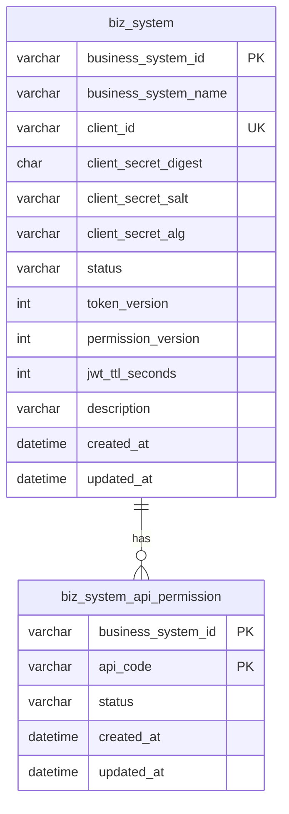

# 数据库设计

## 当前持久化范围

当前数据库只保存业务系统接入配置和 API 权限配置。WPS app token、WPS user token、OAuth state 和 USER 断言 nonce 当前保存在本地内存缓存中。

数据库脚本：

- [../src/main/resources/db/schema.sql](../src/main/resources/db/schema.sql)
- [../src/main/resources/db/schema-clean.sql](../src/main/resources/db/schema-clean.sql)
- [../src/main/resources/db/init-business-system-example.sql](../src/main/resources/db/init-business-system-example.sql)

## ER 图

## biz_system

业务系统接入配置表。

| 字段 | 类型 | 约束 | 说明 |
| --- | --- | --- | --- |
| `business_system_id` | `VARCHAR(64)` | PK | 业务系统稳定 ID。 |
| `business_system_name` | `VARCHAR(128)` | NOT NULL | 业务系统名称。 |
| `client_id` | `VARCHAR(64)` | NOT NULL, UNIQUE | 业务系统换 token 使用的 client id。 |
| `client_secret_digest` | `CHAR(64)` | NOT NULL | client secret 摘要。 |
| `client_secret_salt` | `VARCHAR(64)` | NOT NULL | client secret 盐。 |
| `client_secret_alg` | `VARCHAR(32)` | NOT NULL | 摘要算法，当前为 `HMAC-SHA256`。 |
| `status` | `VARCHAR(16)` | NOT NULL | `ENABLED` 或 `DISABLED`。 |
| `token_version` | `INT UNSIGNED` | NOT NULL | token 版本，变更后旧 JWT 失效。 |
| `permission_version` | `INT UNSIGNED` | NOT NULL | 权限版本，变更后旧 JWT 失效。 |
| `jwt_ttl_seconds` | `INT UNSIGNED` | NOT NULL | 该业务系统 JWT TTL。 |
| `description` | `VARCHAR(255)` | NULL | 描述。 |
| `created_at` | `DATETIME(3)` | NOT NULL | 创建时间。 |
| `updated_at` | `DATETIME(3)` | NOT NULL | 更新时间。 |

索引：

| 索引 | 字段 | 说明 |
| --- | --- | --- |
| PRIMARY | `business_system_id` | 主键。 |
| `uk_biz_system_client` | `client_id` | token 换取时按 client id 查询。 |

## biz_system_api_permission

业务系统 API 权限表。

| 字段 | 类型 | 约束 | 说明 |
| --- | --- | --- | --- |
| `business_system_id` | `VARCHAR(64)` | PK | 业务系统 ID。 |
| `api_code` | `VARCHAR(64)` | PK | API 能力码。 |
| `status` | `VARCHAR(16)` | NOT NULL | `ENABLED` 或 `DISABLED`。 |
| `created_at` | `DATETIME(3)` | NOT NULL | 创建时间。 |
| `updated_at` | `DATETIME(3)` | NOT NULL | 更新时间。 |

主键为 `(business_system_id, api_code)`，用于能力 API 鉴权。

## 权限版本设计

JWT 中携带 `tokenVersion` 和 `permissionVersion`：

- 禁用或强制重置某业务系统 token 时，提升 `token_version`。
- 调整业务系统权限后，提升 `permission_version`。
- 请求能力 API 时，服务会比较 JWT claim 和数据库当前版本，不一致则返回 `TOKEN_INVALID`。

## 示例数据

`init-business-system-example.sql` 会创建本地示例业务系统：

| 字段 | 值 |
| --- | --- |
| `business_system_id` | `biz_local_demo` |
| `client_id` | `local-client` |
| `status` | `ENABLED` |
| `jwt_ttl_seconds` | `1800` |

示例权限包括：

- `app-preview:create`
- `user-files:list`
- `user-files:rename`
- `user-files:download`
- `user-files:create`
- `user-files:view`
- `user-files:delete`
- `user-files:update`

## 后续演进建议

生产环境建议补充以下持久化能力：

| 数据 | 建议存储 | 说明 |
| --- | --- | --- |
| WPS app token | Redis | 设置 TTL 和分布式刷新锁。 |
| WPS user token | Redis 或数据库加密列 | 按 `userId` 或扩展维度缓存，敏感字段加密。 |
| OAuth state | Redis | 短 TTL，一次性消费。 |
| USER nonce | Redis | 以 `businessSystemId + nonce` 存储，TTL 等于签名时间窗口。 |
| 审计日志 | 数据库或日志平台 | 记录业务系统、用户、API code、结果、requestId。 |
