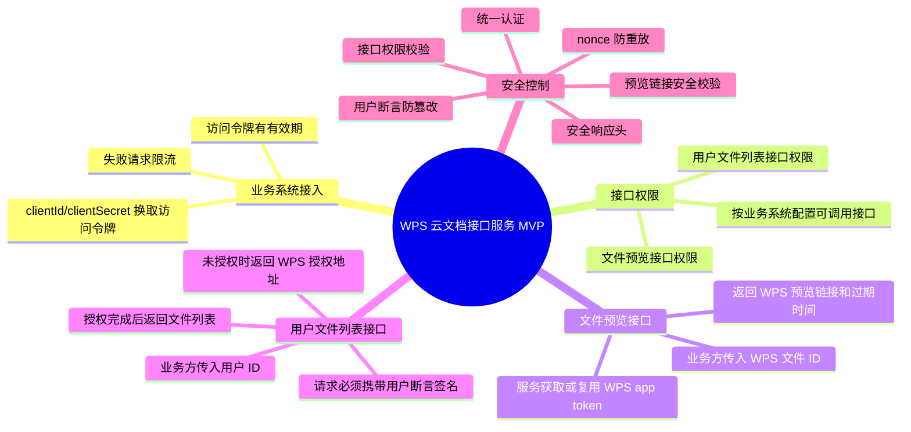
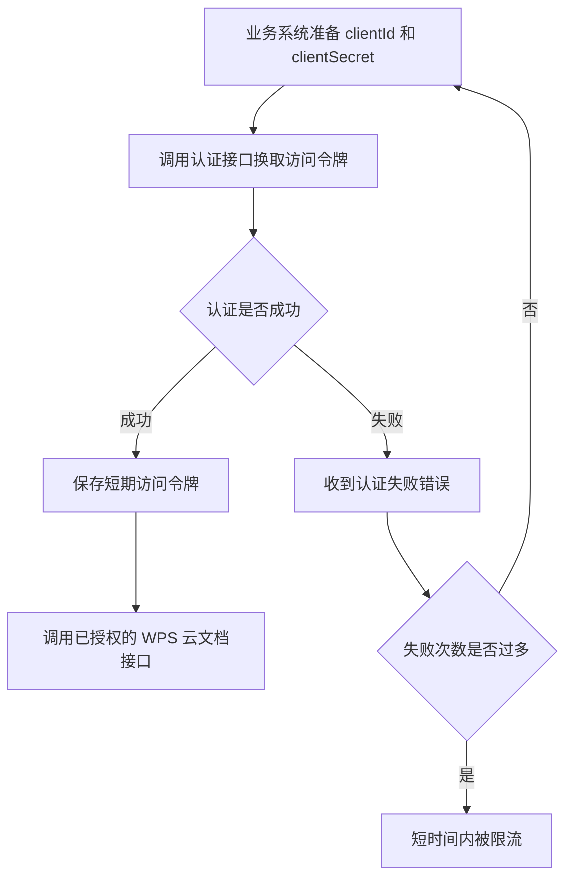
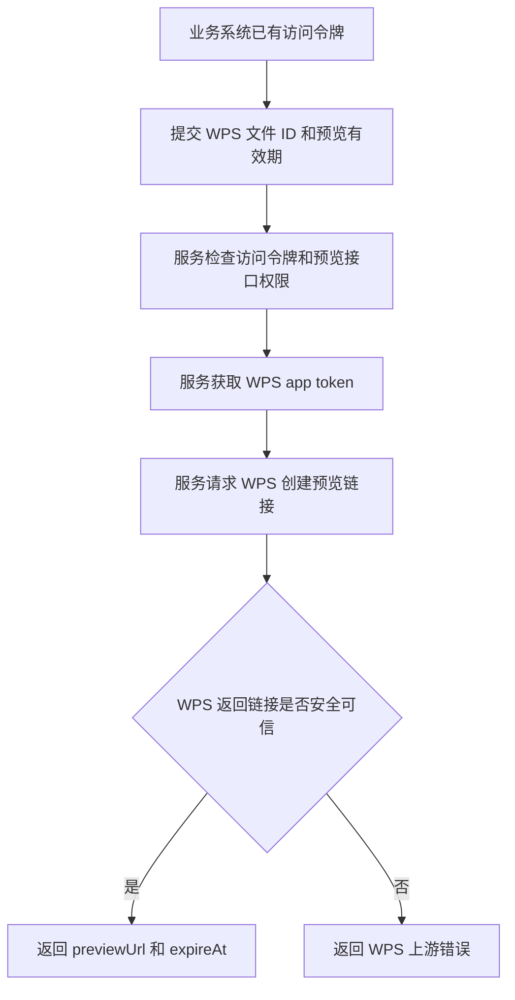
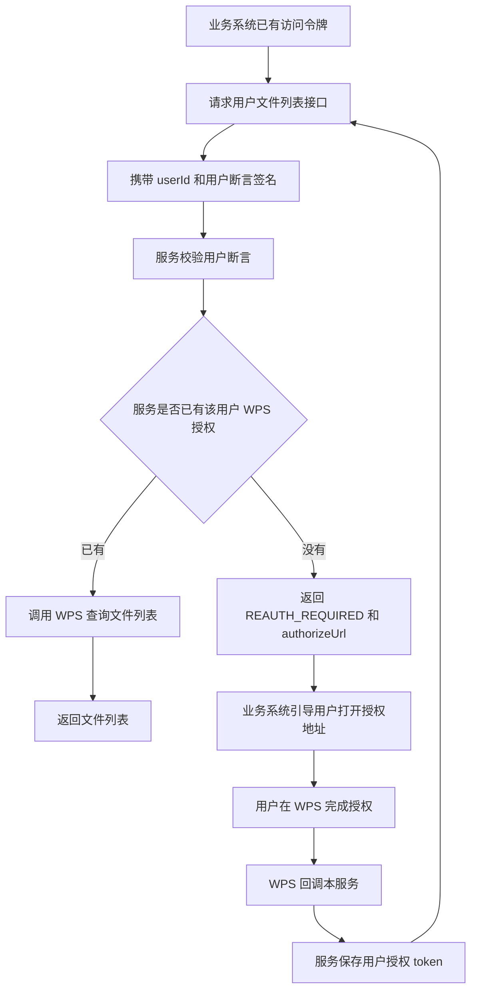

# WPS 云文档接口服务 MVP 特性文档

## 1. 特性概述

### 用户故事

作为一个需要接入 WPS 云文档的业务系统，我希望通过一组统一的内部接口完成文件预览和用户文件列表查询，而不需要自己保存 WPS 的 app 密钥、访问 token 或直接理解 WPS OpenAPI 的调用细节。

作为平台运维和安全负责人，我希望所有业务系统调用这些接口前都经过统一认证、接口权限校验、限流和安全检查，避免密钥泄露、越权调用和问题不可追踪。

作为最终使用业务系统的用户，我希望在业务系统里查看 WPS 文件或授权业务系统查看自己的 WPS 文件列表时，流程清晰、安全，并且不需要反复授权。

### 特性目标

本特性提供一组简化版 WPS 云文档对外接口，当前聚焦三件事：

- 业务系统先用自己的 `clientId` 和 `clientSecret` 换取接口访问令牌。
- 业务系统使用访问令牌调用文件预览接口。
- 业务系统在用户完成 WPS 授权后，代表该用户调用文件列表接口。

### 当前版本边界

当前是 MVP 简化版，明确不包含以下完整体功能：

- 不提供业务系统管理后台页面。
- 不支持业务方直接上传文件流后生成预览。
- 不支持用户文件的新建、重命名、删除、下载、保存为等完整文件操作。
- 不把 WPS app token、WPS user token、OAuth state 持久化到数据库。
- 不面向浏览器或移动端直接开放接口，当前只适合服务端系统之间调用。

## 2. 特性全景描述

### 功能地图



### 功能清单

| 模块 | 功能 | 当前状态 |
| --- | --- | --- |
| 业务系统认证 | 使用 `clientId + clientSecret` 换取接口访问令牌 | 已实现 |
| 认证限流 | 访问令牌换取失败过多时限制请求 | 已实现 |
| 接口权限 | 每个业务系统只能调用已授权接口 | 已实现 |
| 文件预览接口 | 通过 WPS 文件 ID 获取预览链接 | 已实现 |
| 用户文件列表接口 | 通过 WPS user token 查询用户文件列表 | 已实现 |
| 用户授权引导 | 未授权时返回 WPS 授权地址 | 已实现 |
| WPS 授权回调 | WPS 回调后保存用户授权 token | 已实现 |
| 文件流预览接口 | 业务方上传文件流后生成预览 | 未实现 |
| 用户文件写接口 | 新建、改名、删除、上传、下载等 | 未实现 |

## 3. 交互原型图

当前特性主要是系统之间的接口交互，没有可视化管理后台。下面用流程原型表达业务系统、用户、本服务和 WPS 之间的交互路径。

### 3.1 业务系统接入路径



业务方能看到的结果：

- 成功：拿到访问令牌、过期时间和可调用接口列表。
- 失败：拿到明确错误码，例如认证失败、业务系统禁用、请求过多。

### 3.2 文件预览接口路径



业务方能看到的结果：

```text
previewUrl: 可打开的 WPS 预览链接
expireAt: 预览链接过期时间
```

### 3.3 用户文件列表授权路径



业务方能看到的结果：

- 已授权：直接返回文件列表。
- 未授权：返回授权地址，业务系统需要引导用户完成 WPS 授权。

## 4. 特性说明

### 4.1 业务系统换取访问令牌

#### 功能描述

业务系统使用预先分配的 `clientId` 和 `clientSecret` 调用认证接口，换取短期访问令牌。后续调用文件预览接口、用户文件列表接口时，都需要带上这个访问令牌。

#### 业务规则

- 只有已登记且启用的业务系统可以换取访问令牌。
- `clientSecret` 不以明文保存在数据库中。
- 访问令牌有过期时间。
- 访问令牌中带有业务系统身份和权限版本。
- 连续失败过多会被限流，避免暴力猜测密钥。

#### 验收标准

- 给定正确的 `clientId` 和 `clientSecret`，调用方可以拿到访问令牌。
- 给定错误密钥，调用方拿不到访问令牌，并收到认证失败错误。
- 给定被禁用的业务系统，调用方拿不到访问令牌。
- 同一个调用方短时间内多次认证失败后，会收到请求过多错误。
- 返回内容中包含访问令牌、过期时间和可调用接口列表。

### 4.2 接口权限校验

#### 功能描述

业务系统拿到访问令牌后，也不能调用所有接口。本服务会根据数据库里的权限配置，判断当前业务系统是否可以调用某个接口。

#### 业务规则

- 文件预览接口需要 `app-preview:create` 权限。
- 用户文件列表接口需要 `user-files:list` 权限。
- 业务系统被禁用后，已有访问令牌也不能继续使用。
- 权限版本变化后，旧访问令牌会失效，需要重新换取。

#### 验收标准

- 有权限的业务系统可以调用对应接口。
- 没有权限的业务系统调用接口时会被拒绝。
- 业务系统禁用后，接口调用会被拒绝。
- 权限调整后，旧访问令牌不再通过校验。

### 4.3 文件预览接口

#### 功能描述

业务系统传入一个已经存在于 WPS 中的文件 ID，本服务向 WPS 申请预览链接，并把链接返回给业务系统。

#### 业务规则

- 当前只支持业务系统传入 WPS 文件 ID。
- 传入的是 WPS 文件 ID，不是文件流。
- 预览有效期必须在允许范围内。
- 服务会复用有效的 WPS app token。
- WPS 返回的预览链接必须是 HTTPS。
- WPS 返回的预览链接域名必须在允许范围内。
- WPS 返回的过期时间不能明显超过业务系统请求的有效期。

#### 验收标准

- 给定合法文件 ID 和有效期，可以返回预览链接。
- 给定非法文件 ID，例如包含路径穿越字符，会被拒绝。
- 给定过短或过长的有效期，会被拒绝。
- WPS 返回非 HTTPS 链接时，服务不会把链接返回给业务系统。
- WPS 返回不可信域名时，服务不会把链接返回给业务系统。

### 4.4 用户文件列表接口

#### 功能描述

业务系统可以代表某个用户查询该用户在 WPS 中的文件列表。为了避免业务系统请求被篡改，调用该接口时必须对本次请求进行用户断言签名。

#### 业务规则

- 请求必须带访问令牌。
- 请求必须带 `userId`。
- 请求头里的用户 ID 必须和参数里的用户 ID 一致。
- 请求必须带时间戳、随机串和签名。
- 同一个随机串不能重复使用。
- 单次列表查询最多返回 200 条。
- 未完成 WPS 用户授权时，不直接返回文件列表，而是返回授权地址。

#### 验收标准

- 已完成 WPS 授权的用户，可以查询文件列表。
- 未完成 WPS 授权的用户，会收到需要授权的错误和授权地址。
- 篡改 `userId` 后，请求会被拒绝。
- 重放旧请求或重复随机串，请求会被拒绝。
- 超过最大分页数量，请求会被拒绝。

### 4.5 WPS 用户授权回调

#### 功能描述

当用户打开授权地址并在 WPS 完成授权后，WPS 会回调本服务。本服务使用回调里的授权码换取 WPS user token，并保存起来，供后续查询文件列表使用。

#### 业务规则

- 授权回调必须包含 `code` 和 `state`。
- `state` 必须是本服务之前生成的有效值。
- `state` 只能使用一次。
- 授权成功后，本服务按用户维度保存 WPS user token。

#### 验收标准

- 给定有效 `code` 和 `state`，授权回调成功。
- 给定缺失或无效 `state`，授权回调失败。
- 同一个 `state` 重复回调时，第二次会失败。
- 授权成功后，再次查询该用户文件列表可以成功。

## 5. 安全性评估

### 权限与登录

| 风险点 | 当前控制 |
| --- | --- |
| 未认证业务系统调用接口 | 对外接口必须带访问令牌。 |
| 业务系统调用未授权接口 | 按接口权限表校验。 |
| 已禁用业务系统继续调用 | 每次接口调用都会校验业务系统状态。 |
| 权限调整后旧访问令牌继续可用 | 访问令牌中绑定权限版本。 |

### 输入与输出

| 风险点 | 当前控制 |
| --- | --- |
| 文件 ID 注入或路径穿越 | 限制文件 ID 长度和字符，不允许 `..`。 |
| 分页参数过大 | `limit` 最大 200。 |
| 用户 ID 被替换 | 用户断言签名绑定 `userId`。 |
| WPS 返回恶意预览链接 | 校验 HTTPS、域名白名单和过期时间。 |
| 上游错误泄露过多细节 | 统一转换为内部错误码。 |

### 敏感数据

| 敏感数据 | 当前处理 |
| --- | --- |
| `clientSecret` | 数据库只保存摘要，不保存明文。 |
| 访问令牌 | 只适合服务端调用，不应下发给浏览器或移动端。 |
| WPS app token | 服务内部缓存，业务系统不可见。 |
| WPS user token | 服务内部缓存，业务系统不可见。 |
| WPS app secret | 通过配置提供，不应提交到代码仓库。 |

### 重放与伪造

| 风险点 | 当前控制 |
| --- | --- |
| 重放用户文件列表请求 | timestamp 加 nonce 防重放。 |
| 伪造用户文件列表请求 | 使用共享签名密钥校验签名。 |
| 暴力猜测 clientSecret | 访问令牌换取失败限流。 |
| OAuth state 被复用 | state 一次性消费。 |

### 支付交易

当前特性不涉及支付、交易、资金或订单类操作。

### 当前安全限制

- token、state、nonce 当前使用本地内存缓存，多实例部署前需要改为 Redis 或等价集中式存储。
- 当前没有完整审计日志，生产环境建议补充操作审计。
- 当前未实现文件流预览，因此还没有文件大小、文件类型、临时文件清理等控制；后续实现该接口时必须补充。

## 6. 非功能需求

### 性能

| 项目 | 要求 |
| --- | --- |
| 访问令牌换取 | 应能快速完成数据库查询和签发，不依赖 WPS。 |
| 文件预览接口 | 应复用 WPS app token，避免每次都换 token。 |
| 用户文件列表接口 | 单次最多查询 200 条，避免大列表拖慢服务。 |
| WPS 调用 | 设置连接超时、读取超时和有限重试。 |

### 可用性

- WPS 临时失败时，本服务会对部分可重试错误进行有限重试。
- WPS 不可用时，本服务返回明确的上游错误，不返回不完整数据。
- 健康检查包含数据库和关键配置检查。

### 兼容性

- 当前运行基础为 Java 8 和 Spring Boot 2.7.x。
- 数据库面向 MySQL / TDSQL MySQL 兼容形态。
- 对外接口使用 JSON，适合服务端系统集成。

### 可观测性

- 每个响应包含 `requestId`，便于排查问题。
- 支持业务系统传入 `X-Request-Id`。
- 健康检查可用于部署和运行状态确认。
- 生产建议补充指标、审计日志和 WPS 上游调用耗时监控。

### 可维护性

- WPS 调用集中在本服务内部封装，业务系统不直接依赖 WPS OpenAPI。
- 文档和代码按认证、接口、凭证、WPS client、数据库等边界拆分。
- 已接入 PMD 和 SonarCloud，用于发现代码规范问题。

### 部署要求

- 生产环境必须使用真实 WPS 配置。
- 生产密钥必须来自环境变量、配置中心或密钥系统。
- 多实例部署前，应将本地缓存迁移到 Redis 或等价集中式组件。
