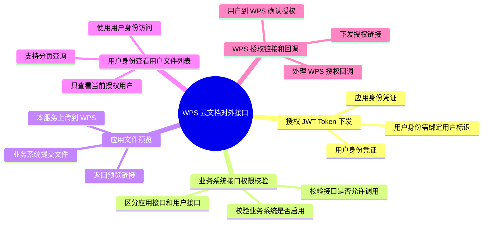
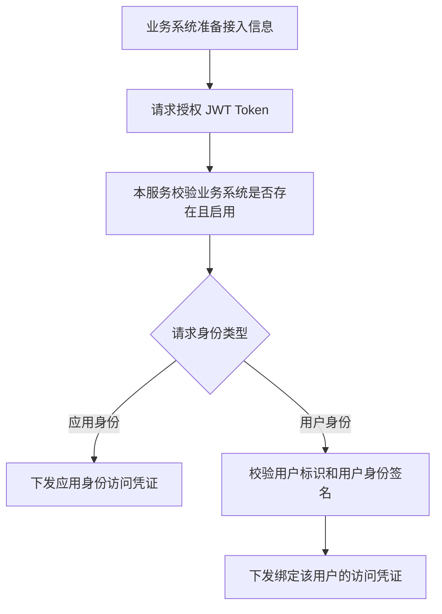
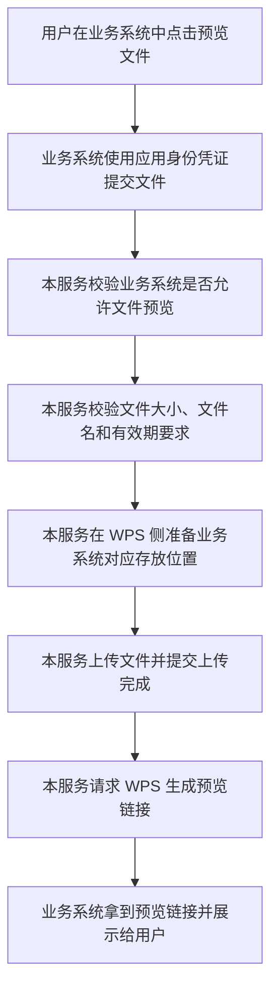
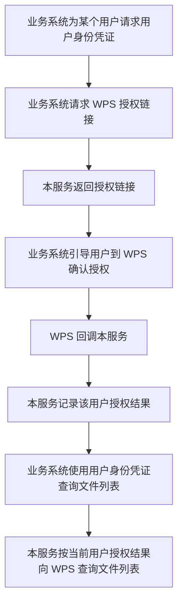

# 特性文档：WPS 云文档对外接口（简化版）

## 1. 特性概述

作为需要接入 WPS 云文档的业务系统，
我想要通过本服务获取应用身份或用户身份的访问凭证，
以便于后续可以按已开通的接口调用文件预览、用户文件列表和 WPS 授权相关接口。

作为业务系统的最终用户，
我想要只有在我完成 WPS 用户授权后，业务系统才可以查看我的 WPS 文件列表，
以便于我的文件范围不会因为业务系统随意传入用户标识而被越权访问。

作为平台运营和安全负责人，
我想要业务系统的接入信息、可调用接口、文件预览和用户授权流程都有明确校验，
以便于降低冒用业务系统、冒用用户、恶意上传文件和高频异常调用带来的风险。

当前简化版只提供服务端对外接口，不提供业务系统管理后台。业务系统接入信息和接口权限通过数据库初始化或运维维护完成；业务系统页面如何展示预览入口、授权按钮和文件列表，不属于本特性范围。

## 2. 特性全景描述

### 方案一：特性功能地图

```mermaid
mindmap
  root((WPS 云文档对外接口))
    授权 JWT Token 下发
      应用身份凭证
      用户身份凭证
      用户身份需绑定用户标识
    业务系统接口权限校验
      校验业务系统是否启用
      校验接口是否允许调用
      区分应用接口和用户接口
    应用文件预览
      业务系统提交文件
      本服务上传到 WPS
      返回预览链接
    用户身份查看用户文件列表
      使用用户身份访问
      只查看当前授权用户
      支持分页查询
    WPS 授权链接和回调
      下发授权链接
      用户到 WPS 确认授权
      处理 WPS 授权回调
```

### 方案二：特性功能列表

| 序号 | 分类 | 功能 | 说明 |
| --- | --- | --- | --- |
| 1 | 授权接入 | 授权 JWT Token 下发 | 业务系统使用接入信息换取访问凭证，可选择应用身份或用户身份；用户身份必须绑定明确用户。 |
| 2 | 访问控制 | 业务系统接口权限校验 | 系统根据数据库中的业务系统和接口权限数据，判断当前业务系统是否可以调用当前接口。 |
| 3 | 应用接口 | 应用文件预览 | 业务系统上传需要预览的文件，本服务上传到 WPS 并返回可使用的预览链接。 |
| 4 | 用户接口 | 用户身份查看用户文件列表 | 用户完成 WPS 授权后，业务系统使用用户身份查看该用户自己的 WPS 文件列表。 |
| 5 | 用户授权 | WPS 授权链接下发和授权回调处理 | 本服务生成 WPS 授权链接，用户授权完成后处理 WPS 回调并记录授权结果。 |

## 3. 交互原型图

当前特性是服务端接口，没有前端管理页面。下面用流程图说明业务系统、用户、本服务和 WPS 之间的交互路径。

### 3.1 授权 JWT Token 下发流程

```mermaid
flowchart TD
    A["业务系统准备接入信息"] --> B["请求授权 JWT Token"]
    B --> C["本服务校验业务系统是否存在且启用"]
    C --> D{"请求身份类型"}
    D -->|应用身份| E["下发应用身份访问凭证"]
    D -->|用户身份| F["校验用户标识和用户身份签名"]
    F --> G["下发绑定该用户的访问凭证"]
```

业务方能理解的结果：

- 应用身份用于调用应用侧接口，例如应用文件预览。
- 用户身份用于调用用户侧接口，例如 WPS 授权入口和用户文件列表。
- 用户身份访问凭证会绑定用户标识，后续不能通过改请求参数切换成其他用户。

### 3.2 应用文件预览流程

```mermaid
flowchart TD
    A["用户在业务系统中点击预览文件"] --> B["业务系统使用应用身份凭证提交文件"]
    B --> C["本服务校验业务系统是否允许文件预览"]
    C --> D["本服务校验文件大小、文件名和有效期要求"]
    D --> E["本服务在 WPS 侧准备业务系统对应存放位置"]
    E --> F["本服务上传文件并提交上传完成"]
    F --> G["本服务请求 WPS 生成预览链接"]
    G --> H["业务系统拿到预览链接并展示给用户"]
```

业务方能理解的结果：

- 业务系统提交的是实际文件，不是只提交 WPS 文件编号。
- 本服务负责完成 WPS 上传、提交和预览链接生成。
- 预览链接有有效期，过期后需要重新发起预览。

### 3.3 用户授权和文件列表流程

```mermaid
flowchart TD
    A["业务系统为某个用户请求用户身份凭证"] --> B["业务系统请求 WPS 授权链接"]
    B --> C["本服务返回授权链接"]
    C --> D["业务系统引导用户到 WPS 确认授权"]
    D --> E["WPS 回调本服务"]
    E --> F["本服务记录该用户授权结果"]
    F --> G["业务系统使用用户身份凭证查询文件列表"]
    G --> H["本服务按当前用户授权结果向 WPS 查询文件列表"]
```

业务方能理解的结果：

- 用户未完成 WPS 授权时，不能查看用户文件列表。
- 用户完成授权后，只能查看该用户授权范围内的文件。
- 授权失效或服务重启导致授权状态丢失时，需要重新引导用户授权。

## 4. 特性说明

### 4.1 授权 JWT Token 下发

#### 功能描述

业务系统调用本服务前，需要先使用数据库中已初始化的接入信息换取授权 JWT Token。当前支持两类身份：

- 应用身份：代表业务系统自身，主要用于应用文件预览。
- 用户身份：代表业务系统中的某个具体用户，主要用于 WPS 授权链接和用户文件列表。

用户身份 Token 必须带有用户标识，并通过用户身份签名校验。这样后续调用用户接口时，系统会以 Token 中绑定的用户为准，而不是相信业务系统在接口参数里临时传入的用户。

#### 场景说明

| 场景说明 | 前置条件 | 触发动作 | 期待结果 |
| --- | --- | --- | --- |
| 获取应用身份访问凭证 | 数据库中存在业务系统记录，且业务系统状态为启用 | 业务系统使用正确接入信息请求应用身份 Token | 系统下发应用身份访问凭证 |
| 获取用户身份访问凭证 | 业务系统状态正常，且用户标识和用户身份签名校验通过 | 业务系统请求用户身份 Token | 系统下发绑定该用户的访问凭证 |
| 拒绝异常 Token 请求 | 业务系统不存在、已停用、接入信息错误，或用户身份签名不正确 | 业务系统请求 Token | 系统拒绝下发访问凭证 |
| 限制高频失败请求 | 同一业务系统短时间内多次请求失败并超过限制 | 业务系统继续请求 Token | 系统短时间内限制继续尝试 |

#### 业务规则

- 当前版本不提供业务系统接入管理后台，接入数据通过数据库初始化或运维维护。
- 应用身份 Token 不能调用用户身份接口。
- 用户身份 Token 必须绑定用户标识，不能作为全局用户通用凭证使用。
- 访问凭证有有效期，过期后业务系统需要重新获取。
- 接入信息和访问凭证属于敏感信息，只应在业务系统服务端保存和使用。

### 4.2 业务系统接口权限校验

#### 功能描述

业务系统拿到 Token 后，不代表可以调用所有接口。本服务会根据数据库中维护的接口权限数据，校验该业务系统是否允许调用当前接口。

例如，某个业务系统只开通了应用文件预览权限，那么它可以调用应用文件预览接口；如果没有开通用户文件列表权限，即使拿到了 Token，也不能查询用户文件列表。

#### 场景说明

| 场景说明 | 前置条件 | 触发动作 | 期待结果 |
| --- | --- | --- | --- |
| 允许调用已开通接口 | 数据库中存在该业务系统的应用文件预览权限，且权限状态为启用 | 业务系统调用应用文件预览接口 | 系统允许继续处理 |
| 拒绝未开通接口 | 数据库中不存在该业务系统的用户文件列表权限，或权限状态未启用 | 业务系统调用用户文件列表接口 | 系统拒绝调用 |
| 拒绝身份类型不匹配 | 业务系统持有应用身份 Token，但目标接口要求用户身份 | 业务系统调用用户接口 | 系统拒绝调用 |
| 按最新权限生效 | 数据库中的接口权限已被调整 | 业务系统再次调用接口 | 系统按最新权限结果判断是否允许 |

#### 业务规则

- 接口权限数据通过数据库初始化或运维维护，当前版本没有管理后台页面。
- 业务系统只能调用已开通且状态启用的接口。
- 应用接口和用户接口需要使用对应身份的 Token。
- 拒绝调用时，业务系统应能识别为“未授权调用当前接口”或“接口权限未启用”。

### 4.3 应用文件预览

#### 功能描述

业务系统可以把需要预览的文件上传给本服务。本服务会先校验业务系统是否允许调用应用文件预览接口，再校验文件大小、文件名、预览链接有效期等要求。

校验通过后，本服务会使用 WPS 应用授权完成后续处理：在 WPS 侧找到或创建业务系统对应的文件存放位置，申请文件上传信息，上传实体文件，提交上传完成，然后使用 WPS 返回的文件标识生成预览链接。业务系统最终拿到的是预览链接、链接有效期和 WPS 文件标识。

#### 场景说明

| 场景说明 | 前置条件 | 触发动作 | 期待结果 |
| --- | --- | --- | --- |
| 成功获取预览链接 | 业务系统拥有应用文件预览权限，上传文件符合平台要求 | 业务系统请求应用文件预览 | 系统返回预览链接、有效期和文件标识 |
| 拒绝不合规文件 | 文件为空、文件名异常、文件过大，或预览有效期不符合要求 | 业务系统请求应用文件预览 | 系统拒绝处理并返回明确错误 |
| WPS 处理失败 | WPS 上传、提交或预览生成过程中失败 | 业务系统请求应用文件预览 | 系统返回上游服务异常，不返回不完整结果 |
| 预览链接过期后重新获取 | 原预览链接已经过期，用户仍需要查看文件 | 业务系统再次发起应用文件预览请求 | 系统重新处理文件预览并返回新的预览结果 |

#### 业务规则

- 应用文件预览必须使用应用身份 Token。
- 文件应由业务系统服务端提交，不建议浏览器或移动端直接上传到本服务。
- 文件大小、文件名和预览有效期必须满足平台限制。
- 本服务会按业务系统在 WPS 侧分开存放预览文件，但这属于服务内部处理，不提供业务系统自助管理页面。
- 预览链接不应被业务系统长期保存后反复使用。

### 4.4 用户身份查看用户文件列表

#### 功能描述

业务系统需要查看某个用户自己的 WPS 文件列表时，必须使用用户身份 Token。该 Token 中已经绑定用户标识，查询文件列表时本服务会以 Token 中的用户为准。

如果业务系统在请求参数中传入用户标识，本服务只允许它和 Token 中的用户一致；如果尝试改成其他用户，系统会拒绝请求。用户未完成 WPS 授权或授权已失效时，本服务不会返回文件列表，而是提示业务系统需要重新引导用户授权。

#### 场景说明

| 场景说明 | 前置条件 | 触发动作 | 期待结果 |
| --- | --- | --- | --- |
| 成功查看用户文件列表 | 用户身份 Token 有效，且该用户已完成 WPS 授权 | 业务系统查询用户文件列表 | 系统返回该用户的文件列表 |
| 未授权时提示授权 | 用户尚未完成 WPS 授权，或当前授权状态已失效 | 业务系统查询用户文件列表 | 系统提示需要先引导用户授权 |
| 拒绝切换其他用户 | 请求参数中的用户与 Token 绑定用户不一致 | 业务系统查询用户文件列表 | 系统拒绝请求 |
| 限制单次查询数量 | 业务系统请求一次返回过多文件并超过平台限制 | 业务系统查询用户文件列表 | 系统拒绝请求或要求按分页继续查询 |

#### 业务规则

- 用户文件列表必须使用用户身份 Token。
- 文件列表只返回当前 Token 绑定用户自己的文件。
- 文件列表支持分页查询，业务系统需要按分页结果继续请求。
- 当前版本只支持查看列表，不提供文件编辑、删除、下载、重命名等文件管理操作。

### 4.5 WPS 授权链接下发和授权回调处理

#### 功能描述

当业务系统需要让用户完成 WPS 授权时，可以使用用户身份 Token 向本服务获取 WPS 授权链接。业务系统把用户引导到该链接后，由用户在 WPS 页面确认授权。

用户确认后，WPS 会回调本服务。本服务校验回调中的授权状态，向 WPS 换取用户授权结果，并记录该用户的授权状态。后续业务系统查询用户文件列表时，本服务会使用该用户的 WPS 授权结果去访问 WPS。

当前简化版的 WPS 用户授权结果保存在服务端本地运行状态中，不是数据库持久化数据。服务重启或多实例部署时，用户可能需要重新授权；生产环境后续需要改为集中式存储。

#### 场景说明

| 场景说明 | 前置条件 | 触发动作 | 期待结果 |
| --- | --- | --- | --- |
| 获取 WPS 授权链接 | 业务系统使用有效的用户身份 Token | 业务系统请求 WPS 授权链接 | 系统返回授权链接和有效期 |
| 处理授权成功回调 | 用户在 WPS 页面完成授权，WPS 携带有效回调信息通知本服务 | 本服务处理 WPS 授权回调 | 系统记录该用户的授权结果 |
| 拒绝异常授权回调 | 授权链接过期、重复使用，或回调参数异常 | 本服务处理 WPS 授权回调 | 系统拒绝处理 |
| 授权失效后重新授权 | 用户授权已失效，或刷新授权结果失败 | 业务系统查询用户文件列表 | 系统提示需要重新授权 |

#### 业务规则

- WPS 授权链接必须由用户身份 Token 获取。
- 授权链接有有效期，业务系统应在有效期内引导用户完成授权。
- 授权结果只适用于完成授权的用户，不能转给其他用户使用。
- 授权结果不能直接暴露给浏览器、移动端或普通用户。
- 多实例或生产环境需要把授权结果迁移到集中式存储，避免不同服务实例状态不一致。

## 5. 安全性评估

| 评估项 | 是否涉及 | 说明 |
| --- | --- | --- |
| 角色权限控制 | 是 | 需要区分业务系统、应用身份和用户身份；不同业务系统可以拥有不同接口权限。 |
| 用户登录认证 | 是 | 本服务不负责业务系统自身登录，但用户接口必须使用绑定用户的访问凭证，并要求用户完成 WPS 授权。 |
| 文件输入/输出 | 是 | 应用文件预览需要接收业务系统提交的文件，并返回 WPS 预览链接。 |
| 数据输入/输出 | 是 | 涉及业务系统接入信息、接口权限、用户标识、WPS 授权结果、文件列表和预览链接。 |
| 敏感数据处理 | 是 | 业务系统接入信息、访问凭证、WPS 授权结果都属于敏感信息，只应在服务端保存和使用。 |
| 支付/交易 | 否 | 当前特性不涉及订单、支付、退款、资金或对账。 |
| 操作审计 | 是 | 建议记录业务系统、身份类型、用户标识、调用接口、处理结果和排查标识，便于问题追踪。 |
| 风险说明 | 是 | 主要风险包括业务系统冒用、用户身份被篡改、未授权查看用户文件、恶意文件上传、预览链接长期滥用和 WPS 服务异常。当前通过 Token 校验、接口权限校验、用户身份绑定、WPS 用户授权、文件限制、链接有效期和异常请求限制降低风险。 |

## 6. 非功能需求

| 类型 | 需求说明 |
| --- | --- |
| 性能 | Token 下发、权限校验和文件列表查询应保持稳定响应；文件预览需要限制单个文件大小和上传处理耗时。 |
| 可用性 | WPS 暂时不可用时，应返回清晰错误；用户授权失效时，业务系统应能重新引导授权。 |
| 兼容性 | 接口面向服务端系统对接；不同环境可以使用不同配置，便于本地、测试、预发和生产部署。 |
| 可观测性 | 每次调用应带有排查标识；生产环境建议补充调用量、失败率、授权成功率、WPS 响应耗时、文件上传大小等监控。 |
| 可维护性 | 授权下发、权限校验、应用文件预览、用户文件列表、WPS 用户授权应保持边界清晰，便于后续扩展更多 WPS 接口。 |
| 数据一致性 | 业务系统接入数据和接口权限数据需要持久保存在数据库中；当前用户授权结果为本地运行状态，多实例生产环境中需要使用集中式存储。 |
