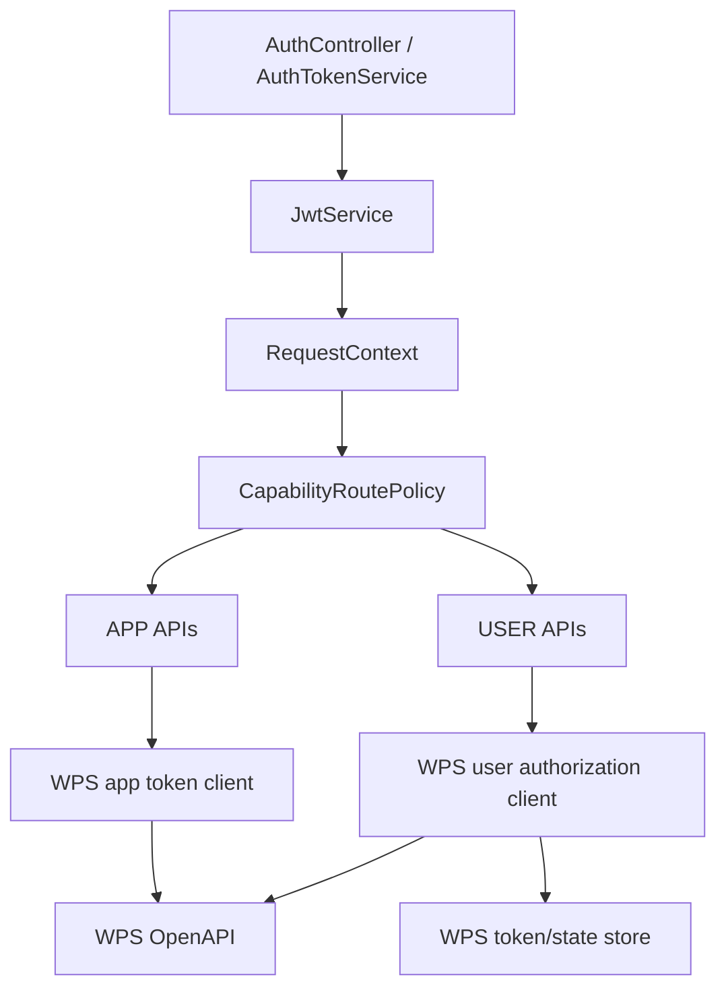

# WPS 应用授权与用户授权统一改造实施计划

## Summary

将内部 JWT 拆成 `APP` 和 `USER` 两种身份模型：APP JWT 继续用于文件预览等应用级能力，USER JWT 绑定 `userId` 并用于 WPS 用户授权、用户 token 刷新和用户文件访问。同时把 WPS OAuth token 调用改为官方文档要求的 `application/x-www-form-urlencoded` 和标准 `grant_type`。

---

## Problem Frame

当前 USER 能力使用业务系统 JWT 加 `userId` 参数和用户断言签名来表达“当前操作用户”。这能防止简单参数篡改，但调用方理解成本较高，也不符合本次确认的产品链路：业务系统应先为某个用户获取内部 JWT，再让该用户完成 WPS 授权，后续 USER 接口从 JWT 中识别用户。

现有 WPS 用户 token 也只保存 access token 和过期时间，没有 refresh token 生命周期；OAuth token 请求仍使用项目内部 JSON/签名封装，和 WPS 官方用户授权文档中的 `oauth2/token` 表单请求不一致。

---

## Requirements

**内部身份模型**

- R1. `POST /api/v1/auth/token` 支持 `identityType=APP` 和 `identityType=USER`。
- R2. 不传 `identityType` 时保持兼容，默认签发 APP JWT。
- R3. USER JWT 必须绑定 `userId`，APP JWT 不绑定 `userId`。
- R4. JWT 校验后必须把 `identityType` 和可选 `userId` 写入请求上下文。
- R5. APP JWT 只能调用 APP 类型能力，USER JWT 只能调用 USER 类型能力，除非后续显式放开。

**WPS OAuth 对接**

- R6. WPS app token 使用 `grant_type=client_credentials` 和 `application/x-www-form-urlencoded` 获取。
- R7. WPS 用户授权链接使用 `https://openapi.wps.cn/oauth2/auth` 参数模型生成。
- R8. WPS 用户 code 换 token 使用 `grant_type=authorization_code` 和表单请求。
- R9. WPS 用户 token 刷新使用 `grant_type=refresh_token` 和表单请求。
- R10. WPS `access_token`、`refresh_token`、`client_secret` 不得下发给业务系统或写入普通日志。

**USER 授权和访问**

- R11. 新增或明确一个授权链接接口，使用 USER JWT 生成 `authorizeUrl`。
- R12. OAuth `state` 必须绑定 `businessSystemId`、`clientId`、`userId`、过期时间，并且只能消费一次。
- R13. WPS 回调成功后保存 user access token、refresh token、token type 和过期时间。
- R14. USER 能力接口从 USER JWT 读取 `userId`，不再依赖普通 query 参数决定用户身份。
- R15. 如果用户未授权、refresh token 失效或刷新失败，返回 `REAUTH_REQUIRED`。

**质量和运维**

- R16. token 获取失败限流、WPS 调用超时、有限重试、预览 URL 安全校验等现有安全能力不能退化。
- R17. 单元测试和集成测试覆盖 APP token、USER token、授权链接、回调、刷新、身份类型拦截和兼容行为。
- R18. 文档同步更新 API 契约、核心链路、WPS 对接、用户授权、安全设计和部署说明。

---

## High-Level Technical Design

APP 和 USER 共享业务系统认证入口，但签发出的 JWT 明确带 `identityType`。路由层根据 API code 判断需要 APP 还是 USER 身份，避免 APP token 和 USER token 混用。

WPS OAuth token endpoint 单独封装为表单请求客户端。它不复用 JSON body 或 KSO-1 签名逻辑，因为官方 OAuth token 文档要求 `application/x-www-form-urlencoded`。

---

## Key Technical Decisions

- KTD1. 内部 JWT 显式增加 `identityType`：用一个 claim 区分 APP 和 USER，避免仅靠 `userId` 是否存在做隐式判断。
- KTD2. `POST /api/v1/auth/token` 默认 APP：保持已有业务系统接入不破坏，USER 调用方再显式传 `identityType=USER` 和 `userId`。
- KTD3. USER 接口以 JWT 中的 `userId` 为准：普通请求参数不再决定用户身份，兼容期即使保留 `userId` 参数也只能做一致性校验。
- KTD4. WPS user token 存储仍以 `userId` 为主键：延续“同一个 WPS 用户授权后可复用”的性能目标；前提是业务侧 `userId` 是全局唯一用户标识。
- KTD5. OAuth token 请求独立于 WPS 业务 API 签名：`oauth2/auth` 和 `oauth2/token` 走官方 OAuth 规则，预览、文件等 WPS 业务 API 继续保留现有 Bearer token 和请求签名封装。
- KTD6. refresh token 是 USER 授权的一等数据：不再只保存 access token；刷新成功返回的新 refresh token 会替换旧值。
- KTD7. 先抽象 token/state 存储，再决定生产后端：本次代码可以保留本地实现用于 MVP 和测试，但接口必须能替换为 Redis 或数据库加密存储。

---

## Implementation Units

### U1. Internal JWT identity model

- **Goal:** 让内部 JWT 支持 APP/USER 两种身份，并在请求上下文中暴露身份类型和用户 ID。
- **Files:** `src/main/java/com/wps/yundoc/auth/api/TokenRequest.java`, `src/main/java/com/wps/yundoc/auth/api/TokenResponse.java`, `src/main/java/com/wps/yundoc/auth/application/AuthTokenService.java`, `src/main/java/com/wps/yundoc/auth/application/JwtService.java`, `src/main/java/com/wps/yundoc/auth/domain/BusinessSystemPrincipal.java`, `src/main/java/com/wps/yundoc/common/context/RequestContext.java`
- **Patterns:** 延续现有 `BusinessSystemPrincipal` 和 `JwtService` 手写 HS256 JWT 模式。
- **Test Scenarios:** APP 请求不传 `identityType` 仍成功；USER 请求缺 `userId` 失败；USER JWT 解析后能得到同一个 `userId`；APP JWT 不包含 `userId`。
- **Verification:** 更新 `src/test/java/com/wps/yundoc/auth/api/AuthControllerTest.java`, `src/test/java/com/wps/yundoc/auth/application/JwtServiceTest.java`, `src/test/java/com/wps/yundoc/auth/application/AuthTokenServiceTest.java`。

### U2. Route-level identity enforcement

- **Goal:** 在能力路由鉴权时校验当前接口需要 APP 还是 USER 身份。
- **Files:** `src/main/java/com/wps/yundoc/auth/infrastructure/CapabilityRoutePolicy.java`, `src/main/java/com/wps/yundoc/auth/infrastructure/JwtAuthenticationFilter.java`, `src/main/java/com/wps/yundoc/businesssystem/domain/WpsIdentityType.java`, `src/main/java/com/wps/yundoc/businesssystem/domain/ApiCode.java`
- **Patterns:** 复用现有 route policy，给每条 route 增加 required identity type。
- **Test Scenarios:** APP JWT 可调用 `/api/v1/app/previews`；APP JWT 调 `/api/v1/user/files` 被拒绝；USER JWT 可调用 `/api/v1/user/files`；USER JWT 调 APP 接口默认被拒绝。
- **Verification:** 更新 `src/test/java/com/wps/yundoc/auth/infrastructure/JwtAuthenticationFilterTest.java`, `src/test/java/com/wps/yundoc/auth/infrastructure/CapabilityRoutePolicyTest.java`。

### U3. USER API userId source migration

- **Goal:** USER 能力接口从 RequestContext/JWT 获取 `userId`，移除对用户断言签名作为主链路的依赖。
- **Files:** `src/main/java/com/wps/yundoc/capability/userfile/api/UserFileController.java`, `src/main/java/com/wps/yundoc/capability/userfile/application/UserFileListCommand.java`, `src/main/java/com/wps/yundoc/capability/userfile/application/UserFileService.java`, `src/main/java/com/wps/yundoc/auth/application/UserAssertionVerifier.java`
- **Patterns:** 保留用户断言相关代码作为兼容或后续删除对象，但新链路不再要求业务方每次 USER 请求额外签 `userId`。
- **Test Scenarios:** 不传 query `userId` 且 USER JWT 有 `userId` 时文件列表进入授权检查；query `userId` 与 JWT `userId` 不一致时失败；APP JWT 无法绕过 userId 检查。
- **Verification:** 更新 `src/test/java/com/wps/yundoc/capability/userfile/api/UserFileControllerTest.java`, `src/test/java/com/wps/yundoc/mvp/MvpSmokeTest.java`。

### U4. WPS OAuth form client

- **Goal:** 按 WPS 官方 OAuth 文档实现 app token、authorization_code 换 user token、refresh user token。
- **Files:** `src/main/java/com/wps/yundoc/wpsclient/infrastructure/WpsAuthorizationHttpClient.java`, `src/main/java/com/wps/yundoc/wpsclient/infrastructure/WpsHttpClient.java`, `src/main/java/com/wps/yundoc/wpsclient/infrastructure/WpsClientProperties.java`, `src/main/java/com/wps/yundoc/wpsclient/application/WpsAuthorizationClient.java`, `src/main/java/com/wps/yundoc/wpsclient/application/WpsAppTokenClient.java`
- **Patterns:** 现有 `WpsClientSupport.executeWithRetry`、超时和 HTTPS 校验继续复用；OAuth token body 改成 `MultiValueMap` 表单，不走 JSON 签名。
- **Test Scenarios:** app token 请求 body 包含 `grant_type=client_credentials`；code 换 token body 包含 `grant_type=authorization_code`；刷新请求 body 包含 `grant_type=refresh_token`；Content-Type 为 `application/x-www-form-urlencoded`。
- **Verification:** 更新 `src/test/java/com/wps/yundoc/wpsclient/infrastructure/WpsPreviewClientTest.java`, `src/test/java/com/wps/yundoc/wpsclient/infrastructure/WpsAuthorizationClientTest.java`。

### U5. WPS user token lifecycle

- **Goal:** 保存和刷新 WPS user token，避免 access token 过期后马上要求用户重新授权。
- **Files:** `src/main/java/com/wps/yundoc/credential/domain/WpsUserToken.java`, `src/main/java/com/wps/yundoc/credential/application/WpsUserAuthorizationService.java`, `src/main/java/com/wps/yundoc/credential/infrastructure/LocalWpsUserTokenCache.java`, `src/main/java/com/wps/yundoc/credential/infrastructure/WpsCredentialProperties.java`
- **Patterns:** 扩展现有本地缓存；为后续 Redis/数据库实现保留清晰接口。
- **Test Scenarios:** access token 未到刷新窗口时直接复用；进入刷新窗口时调用 refresh；刷新成功替换旧 refresh token；刷新失败返回 `REAUTH_REQUIRED`；refresh token 过期返回 `REAUTH_REQUIRED`。
- **Verification:** 更新 `src/test/java/com/wps/yundoc/credential/application/WpsUserAuthorizationServiceTest.java`, `src/test/java/com/wps/yundoc/credential/infrastructure/LocalWpsUserTokenCacheTest.java`。

### U6. Authorization URL endpoint and callback hardening

- **Goal:** 提供明确授权链接接口，并让 callback state 绑定 USER JWT 上下文。
- **Files:** `src/main/java/com/wps/yundoc/credential/api/WpsOauthCallbackController.java`, `src/main/java/com/wps/yundoc/credential/application/WpsUserAuthorizationService.java`, `src/main/java/com/wps/yundoc/credential/domain/OauthState.java`, `src/main/java/com/wps/yundoc/credential/infrastructure/LocalOauthStateCache.java`
- **Patterns:** 沿用 `stateCache.take(state)` 一次性消费；新增 authorize-url controller 时走普通 Bearer JWT 鉴权。
- **Test Scenarios:** USER JWT 可以生成 authorizeUrl；APP JWT 生成授权链接被拒绝；state 过期失败；state 重复消费失败；callback 成功后 token 按 JWT userId 对应的 state 保存。
- **Verification:** 新增或更新 `src/test/java/com/wps/yundoc/credential/api/WpsOauthCallbackControllerTest.java`, `src/test/java/com/wps/yundoc/credential/application/WpsUserAuthorizationServiceTest.java`。

### U7. API docs and migration notes

- **Goal:** 更新文档，让业务系统清楚什么时候拿 APP JWT，什么时候拿 USER JWT。
- **Files:** `README.md`, `docs/api-contract.zh-CN.md`, `docs/core-flows.zh-CN.md`, `docs/wps-integration.zh-CN.md`, `docs/user-authorization.zh-CN.md`, `docs/security-design.zh-CN.md`, `docs/deployment-operations.zh-CN.md`, `docs/testing-quality.zh-CN.md`
- **Patterns:** 使用现有中文文档结构；把旧“用户断言签名”降级为兼容说明或移到历史设计说明。
- **Test Scenarios:** 文档中的接口示例和自动化测试请求字段一致；不再出现 USER 主链路必须传 `X-Yundoc-User-Signature` 的描述。
- **Verification:** 人工审阅文档和测试样例一致性。

---

## Acceptance Examples

- AE1. 给定业务系统只传 `clientId/clientSecret`，当调用 token 接口时，返回 APP JWT，并且该 JWT 可以调用文件预览接口。
- AE2. 给定业务系统传 `identityType=USER` 但没有 `userId`，当调用 token 接口时，返回参数校验失败。
- AE3. 给定业务系统传 `identityType=USER` 和 `userId=user-001`，当调用 token 接口时，返回 USER JWT，JWT 解析后包含 `user-001`。
- AE4. 给定 APP JWT，当调用用户文件列表时，请求被拒绝。
- AE5. 给定 USER JWT 且用户未完成 WPS 授权，当获取授权链接或调用用户文件列表时，返回可引导授权的结果。
- AE6. 给定 WPS 回调携带有效 `code/state`，当服务处理 callback 时，使用表单请求换取 user token 并保存。
- AE7. 给定 WPS user access token 快过期且 refresh token 有效，当调用用户文件列表时，服务先刷新 token，再访问 WPS 文件接口。
- AE8. 给定 refresh token 已失效，当调用用户文件列表时，服务返回 `REAUTH_REQUIRED`。

---

## Scope Boundaries

本次包含：

- 内部 APP/USER JWT 身份模型。
- WPS app token、user token、refresh token 的官方 OAuth 对接。
- USER 授权链接、callback、token 保存和刷新。
- USER 文件列表从 JWT 取用户身份。
- 自动化测试和中文文档更新。

本次不包含：

- 文件流上传到 WPS 后再预览。
- 业务系统前端授权按钮或授权完成页定制。
- WPS 应用市场 ISV 专用授权流程。
- 多租户同名 userId 隔离模型，除非确认业务侧 userId 不是全局唯一。

---

## Risks & Dependencies

| 风险 | 影响 | 缓解 |
| --- | --- | --- |
| `userId` 不是全局唯一 | 不同业务系统同名用户可能共享错误 WPS token | 实施前确认 userId 口径；必要时 token key 改为 `tenantId:userId` 或引入统一用户 ID |
| refresh token 明文保存 | 高敏凭证泄露风险 | 本地实现仅用于 MVP；生产使用加密列、Redis 加密或凭证服务 |
| 并发刷新同一用户 token | 新 refresh token 被旧请求覆盖 | 增加按 userId 的刷新锁；生产用分布式锁 |
| OAuth token 响应格式与旧 envelope 不同 | 旧解析逻辑不适配 | OAuth client 单独建响应模型，不复用 WPS envelope |
| USER 接口调用方需要改造 | 业务系统需要按用户获取 JWT | 保持 APP 默认兼容；文档给出 USER 调用示例和迁移说明 |

---

## Documentation / Operational Notes

- `application-*.yml` 里的 WPS OAuth 路径建议调整为官方默认值：`authorize-path=/oauth2/auth`，`token-path=/oauth2/token`，USER token exchange 和 refresh 复用 token endpoint。
- 生产环境需要配置真实 `redirect-uri`，并在 WPS 开发者后台安全配置中登记。
- 日志脱敏策略需要覆盖 `access_token`、`refresh_token`、`client_secret`、`Authorization`。
- 如果当前环境仍使用本地内存缓存，部署说明必须明确重启后 USER 授权会丢失。

---

## Sources / Research

- `docs/requirements/2026-06-01-wps-app-user-authorization-system-requirements.zh-CN.md`
- `src/main/java/com/wps/yundoc/auth/application/JwtService.java`
- `src/main/java/com/wps/yundoc/auth/application/AuthTokenService.java`
- `src/main/java/com/wps/yundoc/credential/application/WpsUserAuthorizationService.java`
- `src/main/java/com/wps/yundoc/wpsclient/infrastructure/WpsAuthorizationHttpClient.java`
- WPS 用户授权流程：https://open.wps.cn/documents/app-integration-dev/wps365/server/certification-authorization/user-authorization/flow
- WPS 获取用户 access_token：https://open-docs.wpscdn.cn/docs-md/zh/app-integration-dev/wps365/server/certification-authorization/get-token/get-user-access-token.md
- WPS 刷新用户 access_token：https://open-docs.wpscdn.cn/docs-md/zh/app-integration-dev/wps365/server/certification-authorization/get-token/refresh-user-access-token.md
- WPS 应用 access_token：https://open-docs.wpscdn.cn/docs-md/zh/app-integration-dev/wps365/server/certification-authorization/get-token/isvapp-app-access-token.md
