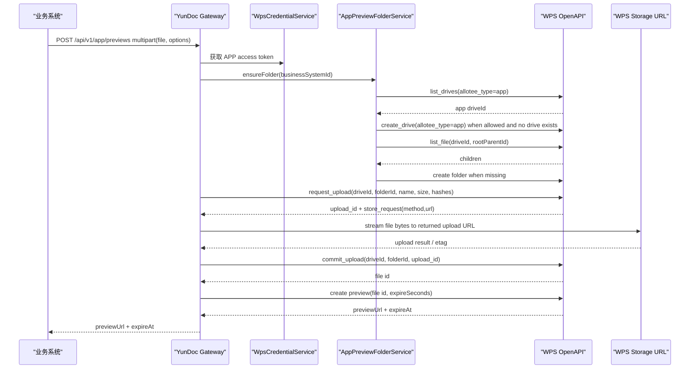

# App Preview Upload-to-WPS Flow Plan

## Summary

将应用授权下的文件预览接口从“业务系统传 WPS fileId”改为“业务系统上传文件流”。服务端使用 APP token 在 WPS 云文档中按业务系统准备独立文件夹，完成 WPS 三段式上传，再用提交后得到的 WPS fileId 创建预览链接并返回给业务系统。

---

## Problem Frame

当前 `POST /api/v1/app/previews` 假设文件已经存在于 WPS 云文档，只接收 `source.fileId` 并创建预览链接。这和新的业务诉求不一致：业务系统手里只有待预览文件，需要把文件流交给网关，由网关上传到 WPS，再基于 WPS 返回的文件 id 获取预览链接。

WPS 官方上传链路要求三步完成：请求上传信息、按返回的存储地址上传实体文件、提交上传完成。除此之外，预览文件要按业务系统隔离目录，避免不同业务系统上传的临时预览文件混在同一个目录下。

---

## Requirements

**External API**

- R1. APP 预览接口必须支持业务系统上传文件流，并接收文件名、文件大小、预览有效期等必要元数据。
- R2. APP 预览接口继续走现有 APP JWT 鉴权和 `app-preview:create` 权限校验。
- R3. 服务端不得要求业务系统提前提供 WPS fileId；WPS fileId 由服务端上传完成后内部获得。
- R4. 响应仍返回 `previewUrl` 和 `expireAt`，可选返回 `fileId` 便于排查，但不要求业务系统继续使用它。

**WPS Folder and Upload**

- R5. 服务端必须使用 APP access token 调用 WPS 文件接口。
- R6. 服务端必须通过 WPS 获取盘列表接口确定应用盘 `driveId`，优先使用 `allotee_type=app` 的应用盘。
- R7. 如果没有可用应用盘，服务端可在显式配置允许时调用 WPS 新建驱动盘接口创建应用盘；默认不在普通请求中静默建盘。
- R8. 服务端必须通过 WPS 获取子文件列表接口查找业务系统文件夹；找不到时再创建文件夹。
- R9. 服务端必须在 WPS 云文档中为每个 `businessSystemId` 准备独立文件夹。
- R10. 文件上传必须按 WPS 官方三步执行：`request_upload`、上传实体文件、`commit_upload`。
- R11. `request_upload` 必须携带文件名、文件大小，并至少携带 `md5` 或 `sha256` 中一种公网必传哈希。
- R12. `commit_upload` 成功后必须从响应中读取 WPS 文件 id，再用该 fileId 获取预览链接。

**Safety and Operations**

- R13. 文件流处理不能一次性完整读入内存；必须采用流式处理或受控临时文件策略。
- R14. 必须限制单文件大小、文件名长度、文件名字符、允许的文件类型，以及上传请求超时。
- R15. 上传到 WPS 的存储地址必须校验为 HTTPS，并限制在可信 WPS/KDocs/WPS365 存储域名范围内，禁止任意 URL 上传导致 SSRF。
- R16. 上传失败、提交失败、预览链接失败时必须返回稳定错误码，并且不能泄露 WPS access token、上传地址签名或内部配置。
- R17. 并发请求同一业务系统目录时不能创建出多个随机目录，也不能因为目录创建冲突导致整个预览链路不可用。
- R18. 自动化测试必须覆盖成功链路、校验失败、WPS 上游失败、文件大小限制、存储 URL 安全校验、目录复用和并发目录初始化。

---

## High-Level Technical Design

The application service should orchestrate the flow, while WPS HTTP details stay in `wpsclient`. Folder identity and upload metadata should be represented as small domain objects so the controller does not know WPS request shapes.

---

## Key Technical Decisions

- KTD1. Use `multipart/form-data` for the external preview endpoint: it matches “业务系统给到文件流”的 requirement and lets Spring handle streamed `MultipartFile` boundaries. The JSON-only `source.fileId` contract should be deprecated for APP preview rather than stretched to carry binary content.
- KTD2. Stage incoming file bytes to a bounded temporary file before WPS upload: WPS `request_upload` requires `size` and公网至少一种 hash, so the service must know size and hash before calling WPS. A temp file avoids keeping the full file in heap and allows a second stream for the actual upload.
- KTD3. Resolve `driveId` through WPS `list_drives`: the normal APP flow should call `GET /v7/drives` with `allotee_type=app`, then select the configured/default application drive. A configured `driveId` can still be supported as an override for fixed environments.
- KTD4. Treat WPS `create_drive` as environment bootstrap or guarded fallback: creating drives changes storage topology and quota, so it should run only when no app drive is found and `autoCreateDrive` is explicitly enabled. When disabled, fail closed with an operational configuration error.
- KTD5. Resolve folders through WPS `list_file`: before creating a business-system folder, list children under the configured root parent and match the deterministic folder name. This gives a recovery path when local DB mapping is missing or stale.
- KTD6. Add APP preview upload properties: file size limit, allowed suffixes, temp directory, optional WPS drive id override, drive name/source, `autoCreateDrive`, root parent id, folder name prefix, upload storage allowed hosts, drive page size, file list page size, and upload conflict behavior should be configurable per environment.
- KTD7. Persist business-system folder mapping: create a small table keyed by `business_system_id` and `drive_id` to store WPS folder id/name. This avoids listing folders on every preview request and makes behavior stable across restarts.
- KTD8. Folder creation must be idempotent: first check local mapping, then list WPS children, create folder only when missing, and handle duplicate/conflict by re-listing before saving the mapping.
- KTD9. Keep WPS upload concerns separate from preview link concerns: introduce a `WpsFileUploadClient` or extend `WpsFileClient` with clear methods for list drives, create drive, list files, create folder, request upload, upload stream, and commit upload. Do not put three-step upload logic inside `WpsHttpClient.createPreview`.
- KTD10. Treat the returned storage URL as untrusted until validated: even though it comes from WPS, the service must still enforce HTTPS, no user-info, no fragment, and allowed host suffixes before sending file bytes.

---

## Implementation Units

### U1. External APP preview upload contract

- **Goal:** Replace or version the current JSON `source.fileId` preview request with a file-upload request that carries file stream and options.
- **Files:** `src/main/java/com/wps/yundoc/capability/apppreview/api/AppPreviewController.java`, `src/main/java/com/wps/yundoc/capability/apppreview/api/AppPreviewRequest.java`, `src/main/java/com/wps/yundoc/capability/apppreview/api/AppPreviewResponse.java`, `src/main/java/com/wps/yundoc/capability/apppreview/application/AppPreviewCommand.java`
- **Patterns:** Keep the existing `ApiResponse` envelope and route `/api/v1/app/previews`; continue reading `businessSystemId` from `RequestContextHolder`.
- **Test Scenarios:** multipart request with valid file succeeds; missing file returns `400`; invalid file name returns `400`; invalid expireSeconds returns `400`; APP permission is still required; USER JWT is still rejected on APP route.
- **Verification:** Update `src/test/java/com/wps/yundoc/capability/apppreview/api/AppPreviewControllerTest.java`.

### U2. Bounded file staging and validation

- **Goal:** Safely receive file content, compute size and hash, and expose a repeatable stream for WPS upload without loading the entire file into memory.
- **Files:** `src/main/java/com/wps/yundoc/capability/apppreview/application/AppPreviewService.java`, new `src/main/java/com/wps/yundoc/capability/apppreview/application/AppPreviewFileStagingService.java`, new `src/main/java/com/wps/yundoc/capability/apppreview/infrastructure/AppPreviewUploadProperties.java`
- **Patterns:** Follow existing validation style using `YundocException` and stable `YundocErrorCode`; keep implementation behind application service rather than controller.
- **Test Scenarios:** valid file produces size and sha256; file over configured limit fails before WPS calls; blank/unsafe file name fails; temp file is deleted after success and after failure; large test stream does not require byte-array buffering.
- **Verification:** Add `src/test/java/com/wps/yundoc/capability/apppreview/application/AppPreviewFileStagingServiceTest.java`.

### U3. Business-system WPS folder registry

- **Goal:** Ensure each business system has one reusable WPS folder for APP preview uploads.
- **Files:** `src/main/resources/db/schema.sql`, `src/main/resources/db/schema-clean.sql`, new mapper XML under `src/main/resources/mapper/apppreview/`, new PO/mapper classes under `src/main/java/com/wps/yundoc/capability/apppreview/infrastructure/`, new service `src/main/java/com/wps/yundoc/capability/apppreview/application/AppPreviewFolderService.java`
- **Patterns:** Mirror `BizSystemMapper` and MyBatis XML conventions; use parameterized mapper SQL only.
- **Test Scenarios:** lists APP drives and selects an active application drive; when no drive exists and auto-create is enabled, creates one APP drive; when no drive exists and auto-create is disabled, fails closed; creates mapping when missing; reuses mapping when present; rehydrates stale/missing local mapping by listing WPS children; concurrent initialization for the same business system returns one folder id; disabled or missing local mapping does not bypass APP authorization; folder name is deterministic and sanitized from `businessSystemId`.
- **Verification:** Add mapper/service tests near `src/test/java/com/wps/yundoc/capability/apppreview/`.

### U4. WPS file create and upload client

- **Goal:** Implement WPS list drives, create drive, list files, create folder, request upload, upload stream, and commit upload using official WPS API shapes.
- **Files:** `src/main/java/com/wps/yundoc/wpsclient/application/WpsFileClient.java`, new request/result domain classes under `src/main/java/com/wps/yundoc/wpsclient/application/`, `src/main/java/com/wps/yundoc/wpsclient/infrastructure/WpsFileHttpClient.java`, `src/main/java/com/wps/yundoc/wpsclient/infrastructure/WpsClientProperties.java`, `src/main/java/com/wps/yundoc/wpsclient/infrastructure/WpsSignedRequestSupport.java`
- **Patterns:** Reuse `WpsClientSupport.executeWithRetry`, `WpsRequestSigner`, and signed JSON headers for OpenAPI calls. For entity upload, use the method/url returned by WPS and sign/authorize according to the upload doc.
- **Test Scenarios:** list drives sends `GET /v7/drives?allotee_type=app&page_size=...`; create drive sends `POST /v7/drives/create` with `allotee_type=app`, configured name, source, and quota; list files sends `GET /v7/drives/{drive_id}/files/{parent_id}/children` and handles pagination; create folder sends `POST /v7/drives/{drive_id}/files/{parent_id}/create`; request upload sends `POST /v7/drives/{drive_id}/files/{parent_id}/request_upload`; request upload includes `name`, `size`, and hash; upload stream uses returned method/url; commit upload sends `upload_id`; WPS non-zero envelope maps to `WPS_UPSTREAM_ERROR`; insecure upload URL is rejected.
- **Verification:** Extend `src/test/java/com/wps/yundoc/wpsclient/infrastructure/WpsFileClientTest.java` and add focused upload tests if the file becomes too broad.

### U5. APP preview orchestration

- **Goal:** Wire APP token, folder ensure, staged file upload, commit result, and preview link creation into one application flow.
- **Files:** `src/main/java/com/wps/yundoc/capability/apppreview/application/AppPreviewService.java`, `src/main/java/com/wps/yundoc/capability/apppreview/application/AppPreviewResult.java`, `src/main/java/com/wps/yundoc/wpsclient/application/WpsPreviewRequest.java`, `src/main/java/com/wps/yundoc/wpsclient/infrastructure/MockWpsClient.java`
- **Patterns:** Keep `WpsCredentialService.appCredential()` as the single source for APP access token; keep preview URL validation in the WPS preview client.
- **Test Scenarios:** service calls folder ensure before upload; service calls request upload, upload stream, commit, preview in order; returned preview link comes from committed file id; upstream failure stops later steps; temp file cleanup runs on all paths.
- **Verification:** Update `src/test/java/com/wps/yundoc/capability/apppreview/application/AppPreviewServiceTest.java`.

### U6. Configuration and docs

- **Goal:** Make environment-specific WPS upload settings explicit and update Chinese documentation for the new preview contract.
- **Files:** `src/main/resources/application.yml`, `src/main/resources/application-local.yml`, `src/main/resources/application-dev.yml`, `src/main/resources/application-st.yml`, `src/main/resources/application-uat.yml`, `src/main/resources/application-prd.yml`, `src/test/resources/application-test.yml`, `docs/api-contract.zh-CN.md`, `docs/core-flows.zh-CN.md`, `docs/wps-integration.zh-CN.md`, `docs/security-design.zh-CN.md`, `docs/testing-quality.zh-CN.md`
- **Patterns:** Follow the current environment YAML split and existing Chinese docs structure.
- **Test Scenarios:** configuration health check fails when real WPS mode lacks required upload/list/create paths, drive creation settings, or root parent id; test profile uses mock WPS client; docs examples match controller tests.
- **Verification:** Update `src/test/java/com/wps/yundoc/common/config/YundocConfigurationHealthIndicatorTest.java` and run full `clean verify pmd:pmd`.

---

## Acceptance Examples

- AE1. Given a business system with `app-preview:create`, when it uploads `合同.docx` to `POST /api/v1/app/previews`, then the service uploads the file to WPS and returns a preview URL.
- AE2. Given no configured drive override, when the first APP preview request starts, then the service calls WPS `list_drives` with `allotee_type=app` and uses an active application drive.
- AE3. Given no APP drive exists and `autoCreateDrive=true`, when the first APP preview request starts, then the service creates one APP drive and uses it for the upload.
- AE4. Given no APP drive exists and `autoCreateDrive=false`, when the first APP preview request starts, then the service fails with an operational configuration error instead of silently creating storage.
- AE5. Given the local folder mapping is missing but the WPS folder already exists, when the preview request starts, then the service calls WPS `list_file`, finds the folder by deterministic name, and saves the mapping without creating a duplicate folder.
- AE6. Given the same business system previews two files, when the second request starts, then the service reuses the existing WPS business-system folder instead of creating a new one.
- AE7. Given two concurrent preview requests from the same business system and no folder mapping exists, when both requests run, then both end up using one deterministic folder mapping.
- AE8. Given a file larger than the configured max size, when the request reaches the controller, then the service returns validation failure and does not call WPS.
- AE9. Given WPS request-upload returns an upload URL outside allowed WPS storage hosts, when the service validates it, then upload is rejected and no file bytes are sent.
- AE10. Given WPS commit-upload succeeds and returns file id `wps-file-001`, when preview is created, then the preview client receives `wps-file-001`.

---

## Scope Boundaries

Included:

- APP preview upload from business system file stream.
- WPS application drive discovery with `list_drives`.
- Optional WPS application drive bootstrap with `create_drive`.
- WPS folder discovery with `list_file`.
- WPS business-system folder creation/reuse.
- WPS three-step upload flow.
- Preview link creation from committed WPS file id.
- File upload safety controls and tests.
- Configuration and Chinese documentation updates.

Not included:

- USER authorization file upload flow.
- Business system frontend changes.
- Permanent lifecycle cleanup of uploaded preview files in WPS.
- Virus scanning or DLP inspection before upload.
- Migrating existing already-issued preview requests that used `source.fileId`.

---

## Open Questions

- OQ1. WPS root `parent_id` should come from configuration. The implementation can default `parent_id` to `0`, while `drive_id` should normally be discovered with `list_drives` and may be overridden by configuration.
- OQ2. The external API shape should be confirmed: preferred plan is `multipart/form-data` with `file`, `expireSeconds`, and optional `displayName`; if consumers require JSON plus separate upload endpoint, the plan needs a contract split.
- OQ3. If multiple APP drives are returned, the selection rule must be explicit: configured drive id first, otherwise configured drive name/source, otherwise the first active app drive.
- OQ4. `autoCreateDrive` should default to disabled in production unless operations confirms that this service may create and own WPS application drives.

---

## Risks & Dependencies

| Risk | Impact | Mitigation |
| --- | --- | --- |
| Upload requires hash before WPS request | Cannot fully stream directly from inbound request to WPS | Stage to bounded temp file, compute size/hash, then stream temp file to WPS |
| WPS storage upload URL is dynamic | SSRF or token leakage if blindly followed | Validate scheme, authority, host allowlist, and avoid redirects |
| Folder creation races | Duplicate folders or failed first requests under concurrency | Persist mapping, use DB uniqueness, and synchronize/fallback on conflict |
| Drive selection is ambiguous | File may be uploaded to the wrong application drive | Prefer configured drive id/name and fail closed if multiple drives match |
| Automatic drive creation creates storage sprawl | Unexpected drives and quota usage can accumulate | Gate behind explicit `autoCreateDrive`, deterministic drive name, and operation docs |
| Uploaded preview files accumulate in WPS | Storage cost grows over time | Defer cleanup job, but document as operational follow-up |
| Existing JSON `fileId` callers break | Compatibility concern if already integrated | Either version endpoint or keep old JSON path temporarily behind source type; decide before implementation |

---

## Sources / Research

- `src/main/java/com/wps/yundoc/capability/apppreview/api/AppPreviewController.java`
- `src/main/java/com/wps/yundoc/capability/apppreview/application/AppPreviewService.java`
- `src/main/java/com/wps/yundoc/wpsclient/infrastructure/WpsHttpClient.java`
- `src/main/java/com/wps/yundoc/wpsclient/infrastructure/WpsFileHttpClient.java`
- `src/main/resources/db/schema.sql`
- WPS request upload: `https://open.wps.cn/documents/app-integration-dev/wps365/server/yundoc/file-transfer/request_upload`
- WPS upload file: `https://open.wps.cn/documents/app-integration-dev/wps365/server/yundoc/file-transfer/upload-file`
- WPS commit upload: `https://open.wps.cn/documents/app-integration-dev/wps365/server/yundoc/file-transfer/commit_upload`
- WPS create file or folder: `https://open.wps.cn/documents/app-integration-dev/wps365/server/yundoc/file/create_file`
- WPS list files: `https://open.wps.cn/documents/app-integration-dev/wps365/server/yundoc/file/list_file`
- WPS list drives: `https://open.wps.cn/documents/app-integration-dev/wps365/server/yundoc/drive/list_drives`
- WPS create drive: `https://open.wps.cn/documents/app-integration-dev/wps365/server/yundoc/drive/create_drive`
