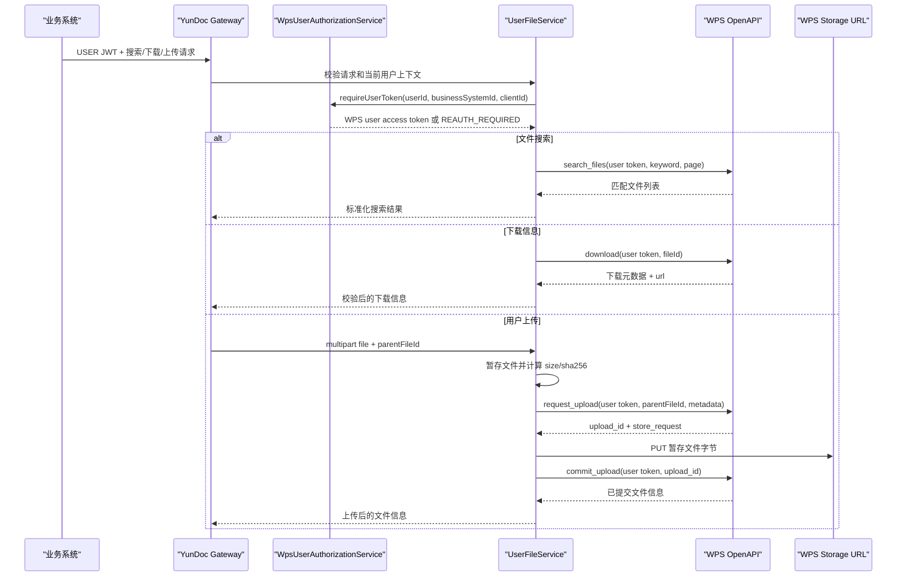

# WPS USER 文件搜索、下载信息与上传实施计划

## Summary

新增邮件附件场景需要的 USER 身份文件能力：搜索用户 WPS 云文档文件、获取选中文件的下载信息、把文件上传到用户自己的 WPS 云文档空间。实现应扩展现有 `userfile` 能力，复用已有 WPS USER token 与三段式上传基础设施，不改变现有 APP 预览上传接口契约。

---

## Problem Frame

发送邮件时，附件可能来自用户自己的 WPS 云文档。当前网关已经支持 USER 授权，也已经有 `GET /api/v1/user/files` 查询文件夹和文件列表；APP 预览上传也已经实现了 WPS 的三段式上传链路：申请上传信息、上传实体文件、提交上传完成。

现在缺的是 USER 维度的对外能力：业务系统需要先在用户云文档里搜索或选择文件，再获取文件下载 `url` 给邮件服务拉取附件；同时还需要支持业务系统把文件上传到用户云文档，而不是上传到 APP 预览专用目录。

这些能力仍然要保持网关边界：业务系统只使用内部 USER JWT 和网关权限码；网关内部使用 WPS user access token；WPS app secret、user refresh token 等敏感凭证不能暴露给业务系统。

---

## Requirements

**对外 USER 接口**

- R1. 网关必须提供 USER 文件搜索接口，允许业务系统按关键词搜索当前用户的 WPS 云文档，并返回标准化文件列表。
- R2. 网关必须提供 USER 文件下载信息接口，接收目标 WPS fileId，返回 WPS 下载信息，其中必须包含下载 `url`。
- R3. 网关必须提供 USER 文件上传接口，接收 multipart 文件流，并上传到用户指定的 WPS 父目录或明确文档化的默认目录。
- R4. 搜索、下载信息、上传接口都必须要求 USER JWT 和对应 API 权限；APP JWT 必须被拒绝。
- R5. 如果接口保留兼容用的 `userId` 参数，该参数必须与 USER JWT 中的 `userId` 一致，不能通过参数替其他用户操作。

**WPS USER 对接**

- R6. 三个新能力都必须通过 `WpsUserAuthorizationService.requireUserToken(...)` 获取 WPS user access token；缺少授权或刷新失败时返回 `REAUTH_REQUIRED`。
- R7. 文件搜索必须对接用户给出的 WPS `search_files` 官方接口，参数必须白名单映射，不能透传任意查询参数。
- R8. 下载信息必须对接用户给出的 WPS download 官方接口，并在返回给业务系统前校验必要字段。
- R9. USER 上传必须使用现有 WPS 三段式上传模型：request upload、上传实体文件、commit upload，并返回提交后的 WPS 文件信息。
- R10. USER 上传必须使用 WPS user access token，不能使用 APP token；上传目的地必须来自用户文件空间，不能复用 APP 预览业务系统文件夹。

**安全、校验和运维**

- R11. 搜索关键词、分页大小、游标等输入必须有长度和范围限制。
- R12. 下载信息响应要按不可信上游处理：必要字段必须存在，URL 必须是 HTTPS，错误和日志不能泄露完整签名 URL、token 或内部配置。
- R13. USER 上传必须复用或抽取 APP 预览上传已有的安全能力：受控临时文件、流式拷贝、文件名校验、大小限制、SHA-256 计算、上传 URL 白名单、只接受 WPS 返回的 `PUT` 方法。
- R14. 对外响应继续使用现有 `ApiResponse` envelope 和稳定错误码。
- R15. 需要更新中文接口文档，让业务系统清楚每个接口的权限码、身份类型、请求格式、响应字段和错误行为。

---

## High-Level Technical Design

对外 API 层放在 `capability.userfile`；WPS HTTP 细节继续封装在 `wpsclient`。上传暂存能力应抽成中立组件，让 APP 预览上传和 USER 上传共用同一套安全实现，但 USER 上传不能依赖 APP 预览文件夹逻辑。

---

## Key Technical Decisions

- KTD1. USER 文件能力继续放在 `/api/v1/user/files` 下：这和现有文件列表接口一致，也复用了 `CapabilityRoutePolicy` 里已经预留的下载和创建路由模式。
- KTD2. 搜索权限需要明确：如果产品认为搜索只是列表能力的另一种形态，可以复用 `user-files:list`；如果希望业务系统可单独开通搜索，建议新增 `user-files:search`。实现前要选定一种，并同步代码、初始化 SQL 和文档。
- KTD3. 下载接口只返回下载信息，不代理文件字节：当前邮件服务需要的是 WPS 返回的 `url`，由邮件服务拉取附件。网关代理下载会引入大文件流式转发、超时、文件名、Content-Type 等额外责任，本期不做。
- KTD4. WPS 上传底层方法可以复用，业务编排要分开：`WpsFileClient.requestUpload`、`uploadFile`、`commitUpload` 可继续作为共享能力，但 APP 预览和 USER 上传分别决定 access token 来源和目标目录。
- KTD5. 先抽取共享上传暂存能力再做 USER 上传：当前 `AppPreviewFileStagingService` 在 APP 预览包内，USER 上传不应直接依赖 APP 命名和配置。应抽到中立包，或用共享服务包装已有逻辑。
- KTD6. 下载 URL 返回前必须校验：即使 URL 来自 WPS，也可能被邮件服务服务端拉取，因此网关至少应校验 HTTPS、无 userInfo、无 fragment；host 白名单可新增下载 URL 白名单配置，或复用已有 WPS host 信任策略。
- KTD7. WPS 官方路径保持配置化：搜索和下载路径应加入 `WpsClientProperties`，不要硬编码。当前项目已有 `yundoc.wps-client.*` 路径配置模式，新增接口应延续这个模式。

---

## Implementation Units

### U1. 对外 USER API 契约和权限路由

- **目标：** 在 `UserFileController` 增加搜索、下载信息、USER 上传接口，并补齐权限码与路由策略。
- **文件：** `src/main/java/com/wps/yundoc/capability/userfile/api/UserFileController.java`, `src/main/java/com/wps/yundoc/businesssystem/domain/ApiCode.java`, `src/main/java/com/wps/yundoc/auth/infrastructure/CapabilityRoutePolicy.java`, `src/main/resources/db/init-business-system-example.sql`
- **模式：** 参考现有 `GET /api/v1/user/files` 的参数校验、上下文读取和 `ApiResponse` 响应封装；继续依赖认证过滤器做 USER/APP 身份隔离。
- **测试场景：** 有权限的 USER JWT 可以调用搜索；APP JWT 被拒绝；缺少权限被拒绝；带 servlet context/path parameter 的路径仍能匹配正确权限；重复或不一致 `userId` 被拒绝；上传路由命中 `user-files:create`；下载信息路由命中 `user-files:download`。
- **验证：** 更新 `src/test/java/com/wps/yundoc/capability/userfile/api/UserFileControllerTest.java` 和 `src/test/java/com/wps/yundoc/auth/infrastructure/CapabilityRoutePolicyTest.java`。

### U2. USER 文件搜索流程

- **目标：** 实现搜索请求/响应模型，以及基于 WPS `search_files` 的服务编排。
- **文件：** `src/main/java/com/wps/yundoc/capability/userfile/application/UserFileService.java`, `src/main/java/com/wps/yundoc/capability/userfile/application/` 下新增搜索 command/result, `src/main/java/com/wps/yundoc/capability/userfile/api/` 下新增搜索 response, `src/main/java/com/wps/yundoc/wpsclient/application/WpsFileClient.java`
- **模式：** 参考 `UserFileListCommand` 和 `UserFileListResult`；如果 WPS 搜索返回和列表相同的 item 结构，就复用 `WpsFileList` / `WpsFileItem`，否则新增窄类型并在 API 层标准化。
- **测试场景：** 已授权用户搜索成功；空关键词失败；超长关键词失败；分页大小越界失败；游标长度受限；缺少 WPS user token 返回 `REAUTH_REQUIRED`；WPS 上游失败映射为 `WPS_UPSTREAM_ERROR`。
- **验证：** 扩展 `src/test/java/com/wps/yundoc/capability/userfile/api/UserFileControllerTest.java`；如果新增 service 单测，则添加或扩展 `src/test/java/com/wps/yundoc/capability/userfile/application/UserFileServiceTest.java`。

### U3. USER 文件下载信息流程

- **目标：** 实现下载信息接口和 WPS client 方法，返回包含 `url` 的校验后下载元数据。
- **文件：** `src/main/java/com/wps/yundoc/capability/userfile/api/UserFileController.java`, `src/main/java/com/wps/yundoc/capability/userfile/application/UserFileService.java`, `src/main/java/com/wps/yundoc/capability/userfile/` 下新增下载 command/result/response, `src/main/java/com/wps/yundoc/wpsclient/application/` 和 `src/main/java/com/wps/yundoc/wpsclient/infrastructure/` 下新增 WPS 下载 DTO
- **模式：** 使用 `POST /api/v1/user/files/{fileId}/download-url`，这和当前 `CapabilityRoutePolicy` 预留的 suffix 路由一致；fileId 校验复用当前资源 ID 校验规则。
- **测试场景：** 合法 fileId 返回 URL 和可用元数据；缺失或非法 fileId 校验失败；缺少 WPS user token 返回 `REAUTH_REQUIRED`；WPS 响应缺少 URL 视为上游错误；HTTP URL 被拒绝；带 userInfo 或 fragment 的 URL 被拒绝；日志不打印完整签名下载 URL。
- **验证：** 扩展 `src/test/java/com/wps/yundoc/capability/userfile/api/UserFileControllerTest.java` 和 `src/test/java/com/wps/yundoc/wpsclient/infrastructure/WpsFileClientTest.java`。

### U4. 共享上传暂存与 USER 上传编排

- **目标：** 新增 USER 上传流程：接收 multipart 文件、暂存并计算 hash、使用 WPS user token 调三段式上传，最后返回提交后的文件信息。
- **文件：** `src/main/java/com/wps/yundoc/capability/userfile/api/UserFileController.java`, `src/main/java/com/wps/yundoc/capability/userfile/application/UserFileService.java`, `src/main/java/com/wps/yundoc/capability/userfile/` 下新增 upload command/result/response, `src/main/java/com/wps/yundoc/capability/apppreview/application/AppPreviewFileStagingService.java`, 可新增中立包 `src/main/java/com/wps/yundoc/capability/upload/application/`
- **模式：** 保留 APP 预览上传已验证过的安全处理：临时文件、流式拷贝、边拷贝边限制大小、SHA-256、文件名安全校验、扩展名白名单、try-with-resources 清理。
- **测试场景：** 上传到指定 `parentFileId` 成功；不传 parent 时使用文档化默认目录；不传 `displayName` 时使用 multipart 文件名；不安全文件名失败；超大文件在 WPS 调用前失败；request-upload、entity-upload、commit-upload 按顺序执行且使用 WPS user token；成功和失败都清理临时文件；APP JWT 被拒绝。
- **验证：** 添加 `src/test/java/com/wps/yundoc/capability/userfile/application/UserFileUploadServiceTest.java` 或扩展 `UserFileServiceTest`；更新 `src/test/java/com/wps/yundoc/capability/userfile/api/UserFileControllerTest.java`；保持或迁移 `src/test/java/com/wps/yundoc/capability/apppreview/application/AppPreviewFileStagingServiceTest.java`。

### U5. WPS client 方法、DTO 和配置

- **目标：** 新增 WPS 搜索和下载信息 HTTP 调用，并把路径与 URL 白名单配置显式化。
- **文件：** `src/main/java/com/wps/yundoc/wpsclient/application/WpsFileClient.java`, `src/main/java/com/wps/yundoc/wpsclient/infrastructure/WpsFileHttpClient.java`, `src/main/java/com/wps/yundoc/wpsclient/infrastructure/WpsClientProperties.java`, `src/main/java/com/wps/yundoc/wpsclient/infrastructure/MockWpsClient.java`, `src/main/java/com/wps/yundoc/wpsclient/infrastructure/MockWpsFileClientAdapter.java`, `src/main/resources/application.yml`, `src/test/resources/application-test.yml`
- **模式：** 复用 `WpsClientSupport.executeWithRetry`、`WpsSignedRequestSupport`、`WpsRequestSigner` 和 envelope 解析；路径拼接放在 WPS client 内，不放到业务 service 里。
- **测试场景：** 搜索请求使用官方 WPS method/path/query/body；下载信息请求使用官方 WPS method/path/query/body；请求携带 Bearer user token；请求携带 KSO 签名头；WPS 非 0 envelope 映射为 `WPS_UPSTREAM_ERROR`；必要 data 为空映射为 `WPS_UPSTREAM_ERROR`；新增配置能正确绑定；如果扩展健康检查，真实 profile 缺少必要路径时 readiness 能发现。
- **验证：** 扩展 `src/test/java/com/wps/yundoc/wpsclient/infrastructure/WpsFileClientTest.java`；如新增配置健康检查，则更新 `src/test/java/com/wps/yundoc/common/config/YundocConfigurationHealthIndicatorTest.java`。

### U6. 文档和运维契约

- **目标：** 更新三个 USER 新接口、WPS 配置和邮件附件使用说明。
- **文件：** `docs/api-contract.zh-CN.md`, `docs/core-flows.zh-CN.md`, `docs/wps-integration.zh-CN.md`, `docs/project-overview.zh-CN.md`, `docs/database-design.zh-CN.md`, `docs/testing-quality.zh-CN.md`
- **模式：** 参考现有中文接口文档结构：路由、鉴权、权限码、请求参数/form 字段、响应体、错误行为。
- **测试场景：** 文档示例和 Controller 测试请求形态一致；如果新增 `user-files:search`，权限示例包含该权限码；下载信息文档明确说明返回 URL 给邮件服务拉取附件，网关不代理文件字节。
- **验证：** 文档 review，加上 API/controller 测试对齐。

---

## Acceptance Examples

- AE1. 给定业务系统有搜索权限，并且使用 `user-001` 的 USER JWT，当搜索关键词 `contract` 时，网关使用 `user-001` 的 WPS user token 查询并返回匹配文件。
- AE2. 给定当前 USER JWT 没有可用 WPS user token，当调用搜索、下载信息或上传接口时，网关返回 `REAUTH_REQUIRED` 和授权链接。
- AE3. 给定业务系统有 `user-files:download` 权限，当请求 `file-001` 的下载信息时，网关返回包含 `url` 的 WPS 下载元数据。
- AE4. 给定 WPS 返回不安全下载 URL，当网关校验下载响应时，返回 `WPS_UPSTREAM_ERROR`，不把该 URL 暴露给业务系统。
- AE5. 给定业务系统有 `user-files:create` 权限，当上传 `invoice.pdf` 到合法父目录时，网关暂存文件，用 WPS user token 完成三段式上传并返回上传后的文件信息。
- AE6. 给定 APP JWT，当调用任一新增 USER 接口时，网关返回 `API_PERMISSION_DENIED`。
- AE7. 给定 USER JWT 属于 `user-001`，当请求里带 `userId=user-002` 时，网关返回 `VALIDATION_FAILED`。
- AE8. 给定上传文件超过大小限制，当请求到达上传接口时，网关在调用 WPS 前返回校验失败。

---

## Scope Boundaries

Included:

- USER 文件搜索，对接 WPS `search_files`。
- USER 文件下载信息获取，对接 WPS download API。
- USER multipart 上传到用户自己的 WPS 云文档空间。
- 新增 WPS client DTO、配置和 mock 支持。
- 复用或抽取安全上传暂存能力。
- 权限路由、自动化测试和中文文档更新。

Not included:

- 邮件发送功能本身。
- 网关代理下载文件字节或附件流式转发。
- 上传前病毒扫描、DLP 或内容审查。
- 用户 WPS 云文档中文件的生命周期清理。
- 前端文件选择器 UI。
- APP 预览上传行为调整，除非为了抽取共享暂存逻辑需要做小范围改造。

---

## Risks & Dependencies

| 风险 | 影响 | 缓解 |
| --- | --- | --- |
| WPS 文档是动态页面，搜索/下载字段需要实现前最终确认 | 真实环境可能因路径或字段不对失败 | 以用户给出的两个 WPS 官方页面为准，实现前确认 method、path、参数和响应 DTO，并先写 WPS client 测试 |
| 搜索权限语义未最终确定 | 权限可能过宽或过窄 | 实现前决定复用 `user-files:list` 还是新增 `user-files:search`，并同步代码、SQL、文档 |
| 下载 URL 可能是短期签名 URL | 邮件服务延迟拉取可能失败 | WPS 提供过期时间时一并返回，并在文档说明邮件服务应尽快拉取 |
| 返回下载 URL 后，邮件服务服务端拉取仍有 SSRF 风险 | 风险转移到邮件服务 | 网关先做 HTTPS 和 URL 结构校验，并提醒邮件服务也要做出站 allowlist |
| 共享暂存逻辑改造可能影响 APP 预览上传 | 已有预览功能可能回归 | 保留 APP 预览测试，先迁移/补齐暂存测试，再改编排 |
| USER 上传默认目录不清楚 | 文件可能进入 root 或错误目录 | 建议要求调用方传 `parentFileId`；如果允许默认 root，必须在文档和测试中明确 |

---

## Sources / Research

- `src/main/java/com/wps/yundoc/capability/userfile/api/UserFileController.java`
- `src/main/java/com/wps/yundoc/capability/userfile/application/UserFileService.java`
- `src/main/java/com/wps/yundoc/auth/infrastructure/CapabilityRoutePolicy.java`
- `src/main/java/com/wps/yundoc/businesssystem/domain/ApiCode.java`
- `src/main/java/com/wps/yundoc/wpsclient/application/WpsFileClient.java`
- `src/main/java/com/wps/yundoc/wpsclient/infrastructure/WpsFileHttpClient.java`
- `src/main/java/com/wps/yundoc/capability/apppreview/application/AppPreviewFileStagingService.java`
- `src/main/java/com/wps/yundoc/capability/apppreview/application/AppPreviewWpsUploadService.java`
- `src/test/java/com/wps/yundoc/capability/userfile/api/UserFileControllerTest.java`
- `src/test/java/com/wps/yundoc/wpsclient/infrastructure/WpsFileClientTest.java`
- WPS 文件搜索：`https://open.wps.cn/documents/app-integration-dev/wps365/server/yundoc/file/search_files`
- WPS 文件下载信息：`https://open.wps.cn/documents/app-integration-dev/wps365/server/yundoc/file/download`
