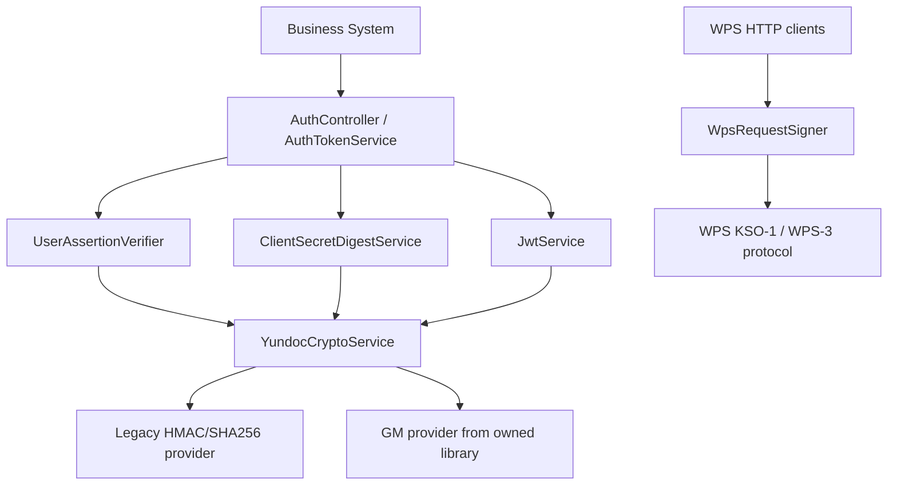

# Business System GM Crypto Plan

## Summary

本计划将网关自定义的业务系统侧签名、摘要、JWT 签名和凭证加密能力改造成可接入自有国密代码库的结构，同时保留 WPS 官方协议签名实现。`KSO-1`、`WPS-3`、WPS OAuth 表单里的 `client_secret` 继续按 WPS 要求处理，不纳入国密替换。

---

## Problem Frame

当前项目里加签、验签和摘要逻辑直接使用 JDK `Mac`、`MessageDigest` 和 `Base64` 分散在认证、WPS client、上传暂存等模块中。业务系统接入相关逻辑主要使用 `HmacSHA256` / `HS256`，不是国密算法；WPS 外呼签名也使用 HMAC，但这是 WPS 协议要求，不能和内部安全机制一起替换。

实施目标是明确协议边界：WPS 协议签名保持稳定，网关与外部业务系统之间的自定义安全能力改为国密，并通过项目内适配层隔离自有国密库的 API、算法名称、编码格式和兼容策略。

---

## Requirements

**Protocol boundaries**

- R1. WPS 请求签名必须保持现状，`WpsRequestSigner` 的 `KSO-1`、`WPS-3` 和 `NONE` 行为不因业务系统侧国密改造变化。
- R2. WPS OAuth token 请求里的 `client_secret` 仍按 WPS 官方表单协议发送，不做国密签名替代。
- R3. 上传给 WPS 的文件摘要默认保持 `SHA-256`，除非 WPS 上传协议或合规要求明确允许/要求替换。

**Business system crypto**

- R4. USER JWT 签发请求的 `X-Yundoc-User-Signature` 验签改为通过项目内国密适配层完成，签名输入字段顺序和防重放语义保持不变。
- R5. 测试侧业务系统加签 helper 必须与生产验签协议一致，覆盖合法签名、错误签名、时间窗口和 nonce 重放。
- R6. `clientSecret` 摘要生成和校验改为支持国密算法，同时保留按 `client_secret_alg` 识别旧摘要的兼容能力。
- R7. 内部 JWT 签发和校验若纳入国密范围，必须支持新算法签发、旧 token 过渡校验、`alg`/header 标识和过期淘汰策略。
- R8. 如果 WPS user token、refresh token 或其他敏感凭证落 Redis/数据库，必须通过国密加密适配层加密保存、读取时解密，当前本地内存缓存不伪装成加密存储。

**Rollout and operations**

- R9. 国密库依赖、算法选择、密钥材料和兼容开关必须通过配置表达，不能在业务代码中硬编码密钥或环境特例。
- R10. 文档、示例 SQL、测试配置和安全设计必须同步更新，避免继续声明业务系统侧使用 `HMAC-SHA256` / `HS256`。
- R11. 改造必须提供回滚/灰度路径：至少支持验签或校验侧双算法兼容，再逐步切换新签发/新摘要。

---

## Assumptions

- A1. 自有国密代码库至少提供 SM2 签名/验签、SM3 摘要或 HMAC-SM3、SM4 加密/解密中的相关能力，并能在 Java 8 / Spring Boot 2.7 环境使用。
- A2. USER 断言签名最终采用 SM2 非对称签名还是 HMAC-SM3 对称签名，需要由接入规范确认；计划用适配接口吸收这项差异。
- A3. JWT 国密化只在本服务签发和校验内部 JWT 的前提下推进；如果外部网关、SDK 或业务系统也要解析验签，需要先统一 JWT header `alg` 和公钥/密钥分发规范。
- A4. 生产 token 持久化后端尚未在当前代码中实现；凭证加密计划以新增持久化实现或未来 Redis/DB 适配为落点。

---

## High-Level Technical Design

核心结构是新增项目内加密适配层，例如 `YundocCryptoService`、`SignatureCodec`、`DigestCodec`、`TokenSigner`、`TextCipher` 一类接口。业务系统侧组件只依赖项目接口；接口实现再调用自有国密库或 legacy JDK 实现。`WpsRequestSigner` 保持独立，不接入这套适配层，避免误改 WPS 协议。

---

## Key Technical Decisions

- KTD1. WPS 协议签名与网关自定义安全机制分离：`src/main/java/com/wps/yundoc/wpsclient/infrastructure/WpsRequestSigner.java` 是外部协议实现，应保持稳定；国密改造只进入 `auth`、未来凭证持久化和相关测试/文档。
- KTD2. 引入项目内 crypto facade，而不是在各 service 里直接调用自有国密库：这样可以统一算法标识、编码、异常映射、测试替身和未来兼容策略。
- KTD3. `client_secret_alg` 作为兼容分流字段继续保留：已有 `HMAC-SHA256` 摘要不能被新算法直接校验，生产切换需要允许旧数据按旧算法校验，新建或重置凭据按国密算法写入。
- KTD4. USER 断言签名优先保持现有签名输入 canonical string：签名算法替换不应改变绑定字段、防重放和 `userId` 一致性语义，减少业务系统接入变更面。
- KTD5. JWT 国密化采用双读单写策略：校验阶段先支持 legacy `HS256` 和新国密 token，签发阶段由配置切到新算法，等待旧 JWT TTL 到期后再关闭 legacy 校验。
- KTD6. 凭证加密只在持久化边界执行：内存缓存可以保存短生命周期对象，但 Redis/DB 持久化实现必须加密 `accessToken`、`refreshToken` 等敏感字段，并避免日志泄露密文/明文。

---

## Implementation Units

### U1. Crypto abstraction and providers

- **Goal:** 新增项目内国密适配层，统一签名、验签、摘要、JWT 签名和文本加解密的入口，并提供 legacy 与 GM 两类实现。
- **Files:** `src/main/java/com/wps/yundoc/auth/application/*` 下新增接口或服务；如范围扩大，可新增 `src/main/java/com/wps/yundoc/common/crypto/*`。
- **Patterns:** 参考现有 Spring service 注入方式；异常统一映射为 `YundocException`，不要让三方库异常穿透到 controller。
- **Test Scenarios:** 在 `src/test/java/com/wps/yundoc/auth/application/*Test.java` 新增或扩展测试，覆盖算法路由、未知算法拒绝、签名编码格式、常量时间比较、三方库异常映射。
- **Verification:** 运行认证相关单测；最终运行 `.\mvnw.cmd clean verify pmd:pmd`。

### U2. USER assertion GM signature verification

- **Goal:** 将 `X-Yundoc-User-Signature` 的验签从直接 `HmacSHA256` 改为调用 crypto facade，保持 canonical string、timestamp、nonce、`userId` 校验语义。
- **Files:** `src/main/java/com/wps/yundoc/auth/application/UserAssertionVerifier.java`、`src/main/java/com/wps/yundoc/auth/application/UserAssertionProperties.java`、`src/test/java/com/wps/yundoc/testsupport/UserAssertionSigner.java`。
- **Patterns:** 保留 `MessageDigest.isEqual` 或 facade 内等价常量时间比较；继续复用 `UserAssertionNonceCache`。
- **Test Scenarios:** `src/test/java/com/wps/yundoc/auth/api/AuthControllerTest.java`、`src/test/java/com/wps/yundoc/auth/infrastructure/JwtAuthenticationFilterTest.java`、`src/test/java/com/wps/yundoc/mvp/MvpSmokeTest.java` 覆盖国密签名成功、签名错误失败、nonce 重放失败、时间戳过期失败、`userId` 不一致失败。
- **Verification:** 跑 auth controller、filter、mvp smoke 相关测试。

### U3. clientSecret digest migration

- **Goal:** `clientSecret` 摘要支持国密算法，新建/重置业务系统使用新算法，存量 `HMAC-SHA256` 数据按 `client_secret_alg` 继续可校验。
- **Files:** `src/main/java/com/wps/yundoc/auth/application/ClientSecretDigestService.java`、`src/main/java/com/wps/yundoc/auth/application/ClientSecretDigestProperties.java`、`src/main/java/com/wps/yundoc/auth/application/AuthTokenService.java`、`src/main/resources/db/schema.sql`、`src/main/resources/db/init-business-system-example.sql`。
- **Patterns:** 延续 `ClientSecretDigest` 返回 `digest/salt/algorithm` 的结构；算法字段不要复用旧名字表达新算法。
- **Test Scenarios:** `src/test/java/com/wps/yundoc/auth/application/ClientSecretDigestServiceTest.java` 覆盖 legacy 校验、新国密摘要生成、新旧算法不串用、未知算法失败；`src/test/java/com/wps/yundoc/testsupport/BusinessSystemFixture.java` 同步生成测试数据。
- **Verification:** 跑 `ClientSecretDigestServiceTest`、`AuthTokenServiceTest` 和依赖业务系统 fixture 的 controller 测试。

### U4. Internal JWT signer migration

- **Goal:** 将 `JwtService` 的签发/校验抽象为可配置 token signer，按配置支持 legacy `HS256` 与新国密算法的过渡。
- **Files:** `src/main/java/com/wps/yundoc/auth/application/JwtService.java`、`src/main/java/com/wps/yundoc/auth/infrastructure/JwtProperties.java`、`src/main/resources/application-*.yml`、`src/test/java/com/wps/yundoc/auth/application/JwtServiceTest.java`。
- **Patterns:** 保持 payload claim、issuer、audience、typ、exp 校验不变；只替换 header `alg`、签名生成和验签分流。
- **Test Scenarios:** 覆盖新算法签发后可校验、legacy token 在兼容期开启时可校验、关闭 legacy 后旧 token 失败、篡改 payload 失败、过期 token 失败、未知 `alg` 失败。
- **Verification:** 跑 `JwtServiceTest`、`JwtAuthenticationFilterTest` 和涉及授权 token 的 API 测试。

### U5. Credential encryption boundary

- **Goal:** 为未来 Redis/DB 凭证存储提供国密加解密边界，明确本地内存缓存不宣称加密，生产持久化实现必须加密敏感字段。
- **Files:** `src/main/java/com/wps/yundoc/credential/infrastructure/LocalWpsUserTokenCache.java`、`src/main/java/com/wps/yundoc/credential/infrastructure/LocalWpsTokenCache.java`、未来新增的 Redis/DB token repository；相关配置在 `src/main/resources/application-*.yml`。
- **Patterns:** 加解密发生在持久化 adapter 内，domain 对象 `WpsUserToken`、`WpsCredential` 保持明文值只在调用链内短暂存在。
- **Test Scenarios:** 新增持久化实现时覆盖写入加密、读取解密、错误密钥失败、空 refresh token 处理、日志不输出 token 明文。
- **Verification:** 本阶段若只新增接口和文档，不强行改本地缓存行为；新增持久化 adapter 时补对应测试。

### U6. Keep WPS signer untouched and protect with tests

- **Goal:** 明确保护 WPS 协议实现，防止国密改造误伤 `KSO-1`、`WPS-3` 或上传摘要。
- **Files:** `src/main/java/com/wps/yundoc/wpsclient/infrastructure/WpsRequestSigner.java`、`src/main/java/com/wps/yundoc/wpsclient/infrastructure/WpsSignedRequestSupport.java`、`src/test/java/com/wps/yundoc/wpsclient/infrastructure/WpsRequestSignerTest.java`、`src/test/java/com/wps/yundoc/wpsclient/infrastructure/WpsFileClientTest.java`。
- **Patterns:** 只补充保护性测试或注释，不把 WPS signer 接入 `YundocCryptoService`。
- **Test Scenarios:** 现有 `KSO-1` 期望签名保持不变；`WPS-3` MD5/HMAC-SHA1 helper 保持不变；`signature-version: NONE` 仍不写签名头；上传 octet-stream 使用传入的 SHA-256。
- **Verification:** 跑 `WpsRequestSignerTest` 和 WPS client 相关测试。

### U7. Configuration, SQL, and documentation update

- **Goal:** 更新所有对 `HMAC-SHA256`、`HS256`、业务系统签名算法和 token 加密策略的配置与文档描述。
- **Files:** `src/main/resources/application-dev.yml`、`src/main/resources/application-local.yml`、`src/main/resources/application-prd.yml`、`src/main/resources/application-st.yml`、`src/main/resources/application-uat.yml`、`src/test/resources/application-test.yml`、`docs/api-contract.zh-CN.md`、`docs/user-authorization.zh-CN.md`、`docs/security-design.zh-CN.md`、`docs/deployment-operations.zh-CN.md`、`docs/database-design.zh-CN.md`。
- **Patterns:** WPS 文档 `docs/wps-integration.zh-CN.md` 继续说明 KSO-1/WPS-3 使用 WPS 指定算法；业务系统文档单独说明国密签名协议。
- **Test Scenarios:** 文档不需要单测，但 `SensitiveLoggingPolicyTest` 可继续覆盖敏感字段；配置绑定测试应覆盖新算法配置字段。
- **Verification:** 全量 `clean verify pmd:pmd` 前先跑配置/健康检查相关测试。

---

## System-Wide Impact

- 认证边界会变化：业务系统生成 USER 断言签名的 SDK、示例和联调脚本必须与服务端同时升级。
- 数据兼容会变化：`biz_system.client_secret_alg` 将从单一 `HMAC-SHA256` 进入多算法状态，运维需要能识别并迁移存量业务系统。
- JWT 兼容会变化：内部调用方通常只透传 JWT，但任何解析 JWT header 或校验签名的外部组件都需要同步协议。
- 凭证保护会增强：一旦接入持久化 token repository，敏感 token 的明文生命周期应限制在调用链内。
- 合规边界更清晰：WPS 协议算法不等于网关自定义算法，安全扫描和文档需要按协议边界解释。

---

## Risks and Dependencies

- **国密库 API 未定:** SM2、SM3、HMAC-SM3、SM4 的具体方法、密钥格式和编码格式会影响适配层实现。实施前需要拿到库文档或示例。
- **业务系统同步成本:** USER 断言签名算法改变后，业务系统必须同步改造加签逻辑。灰度期建议服务端支持 legacy + GM 双验签。
- **存量凭据迁移:** `clientSecret` 摘要不可逆，无法批量直接转换。需要在业务系统重置 secret 时写新算法，或在首次成功登录后另行设计再摘要策略。
- **JWT alg 兼容:** 自定义国密 JWT `alg` 可能不被标准组件识别。若只由本服务签发校验风险较低；若外部组件验签，需提前定规范。
- **误伤 WPS 协议:** 自动化替换 `HmacSHA256` / `SHA-256` 容易改到 WPS signer 或上传摘要。实施时应先加保护性测试再改认证侧。

---

## Acceptance Examples

- AE1. 给定 WPS client 调用预览或文件接口，当业务系统侧国密开关开启后，WPS 请求仍携带原 `X-Kso-Authorization` 格式，现有 WPS client 测试保持通过。
- AE2. 给定业务系统使用国密协议生成 USER 断言签名，当调用 `POST /api/v1/auth/token` 申请 USER JWT 时，服务端验签通过并签发绑定 `userId` 的 JWT。
- AE3. 给定业务系统继续使用旧 HMAC USER 断言签名，当 legacy 兼容开关开启时请求可通过；当兼容开关关闭时请求被拒绝。
- AE4. 给定存量业务系统数据库记录 `client_secret_alg = HMAC-SHA256`，当使用正确 `clientSecret` 换 token 时仍可通过；新建业务系统记录使用新国密算法。
- AE5. 给定 JWT 签发算法配置为国密，当签发 token 后再访问受保护接口时校验通过；篡改 payload 或签名后返回 `TOKEN_INVALID`。
- AE6. 给定生产持久化 token repository 写入 WPS refresh token，数据库或 Redis 中不出现 refresh token 明文，读取后可正常刷新用户 token。

---

## Documentation and Operational Notes

- 更新业务系统接入文档时，应明确签名输入、算法、密钥格式、签名编码、header 名称、timestamp 单位和 nonce 规则。
- 更新部署文档时，应区分 `yundoc.jwt.secret` legacy 配置与国密密钥配置；不要把 WPS `app-secret` 和业务系统签名密钥混用。
- 更新数据库文档时，应说明 `client_secret_alg` 的允许值、默认值和迁移策略。
- 发布前需要给业务系统方提供国密加签示例或 SDK，否则服务端切换会造成接入失败。
- 灰度建议顺序：先上线双算法校验和保护性 WPS 测试，再切新业务系统默认算法，再迁移 USER 断言签名，最后切 JWT 新签发和关闭 legacy。

---

## Sources and Code References

- `src/main/java/com/wps/yundoc/wpsclient/infrastructure/WpsRequestSigner.java`：WPS `KSO-1` / `WPS-3` 签名实现，保持协议稳定。
- `src/main/java/com/wps/yundoc/wpsclient/infrastructure/WpsSignedRequestSupport.java`：WPS 请求统一套签名头的位置，保护不被业务系统国密改造误接入。
- `src/main/java/com/wps/yundoc/auth/application/UserAssertionVerifier.java`：USER 断言验签主入口。
- `src/main/java/com/wps/yundoc/auth/application/ClientSecretDigestService.java`：`clientSecret` 摘要生成和校验。
- `src/main/java/com/wps/yundoc/auth/application/JwtService.java`：内部 JWT 签发和校验。
- `src/main/java/com/wps/yundoc/capability/upload/application/FileStagingService.java`：上传文件 SHA-256 摘要，默认按 WPS 上传链路保留。
- `src/main/resources/db/schema.sql`：`client_secret_digest`、`client_secret_salt`、`client_secret_alg` 持久化字段。
- `docs/api-contract.zh-CN.md`、`docs/user-authorization.zh-CN.md`、`docs/security-design.zh-CN.md`：需要同步业务系统侧国密协议描述。
