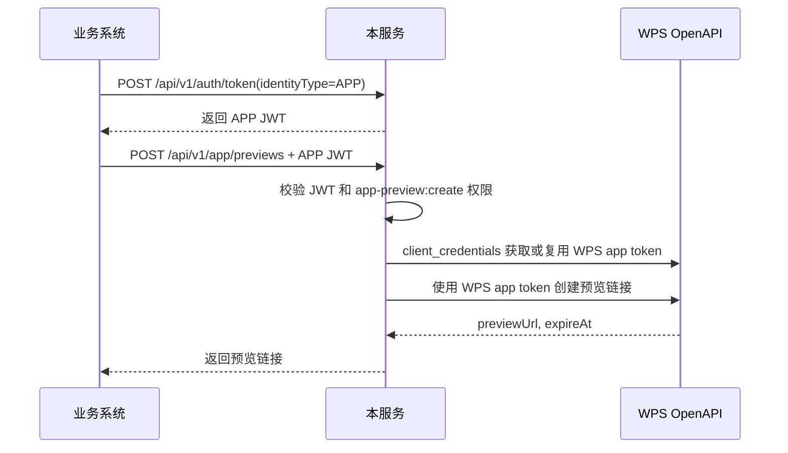
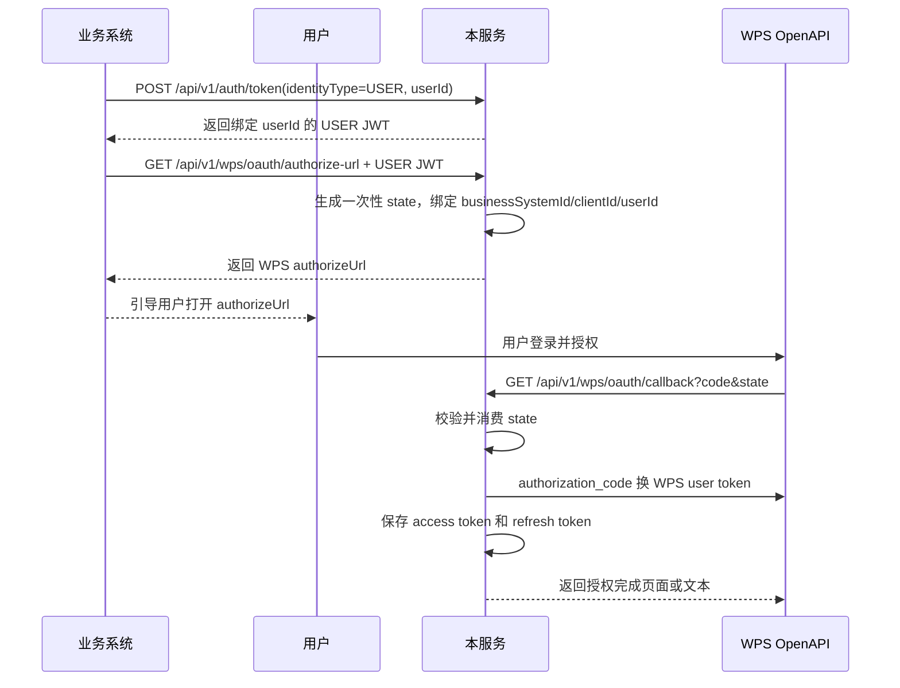
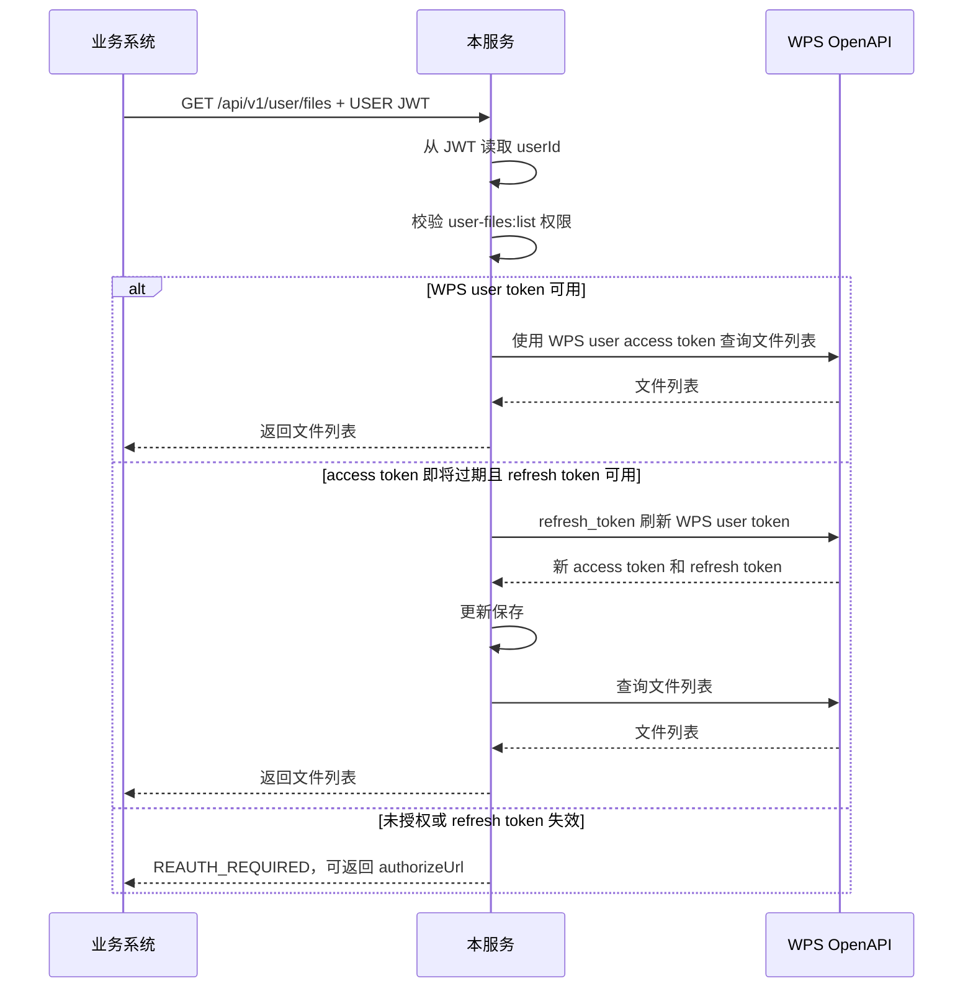

# WPS 应用授权与用户授权统一改造需求说明

## 1. 背景

本服务是业务系统访问 WPS OpenAPI 的服务端中转层。业务系统不直接保存或使用 WPS 的 `client_secret`、`access_token`、`refresh_token`，而是先调用本服务获取内部 JWT，再通过本服务访问 WPS。

当前实现中，APP 场景和 USER 场景都使用同一个业务系统 JWT。USER 场景额外依赖 `userId` 参数和用户断言签名来防止篡改。经过需求确认后，新的目标是把两类授权身份分清楚：

- APP 场景：代表业务系统调用 WPS 应用级接口。
- USER 场景：代表业务系统下的某个用户调用 WPS 用户级接口。

这样业务系统在调用用户相关接口前，需要先为该用户获取一个绑定 `userId` 的内部 JWT，再使用这个 JWT 完成 WPS 用户授权和后续用户文件访问。

## 2. 目标

作为业务系统，我希望通过同一个接入服务分别完成 WPS 应用授权和用户授权，以便我可以安全地创建应用级预览链接，也可以在用户完成 WPS 授权后代表该用户访问 WPS 用户文件。

作为业务系统，我希望 APP 接口继续使用系统级 JWT，不因为用户切换而频繁换 token，以便文件预览等系统级能力保持简单稳定。

作为业务系统，我希望 USER 接口使用绑定用户的 JWT，而不是每次靠普通参数声明用户，以便用户身份边界更清楚，攻击者不能通过篡改 `userId` 操作其他用户。

作为平台运维人员，我希望 WPS token 统一由服务端保存、刷新和脱敏，以便业务系统不接触 WPS 高敏凭证，生产运行也能控制 token 过期、重试、限流和审计风险。

## 3. 授权模型

### 3.1 内部 JWT 类型

| 类型 | 使用场景 | 是否绑定用户 | 允许调用 |
| --- | --- | --- | --- |
| `APP` | 文件预览等应用级接口 | 否 | APP 类型能力接口 |
| `USER` | 用户授权、用户文件列表等用户级接口 | 是 | USER 类型能力接口 |

`APP` JWT 表达的是业务系统身份。`USER` JWT 表达的是业务系统身份加当前业务用户身份。

### 3.2 WPS token 类型

| 类型 | 来源 | 保存位置 | 下发给业务系统 |
| --- | --- | --- | --- |
| WPS app access token | 服务端用 `client_credentials` 换取 | 服务端缓存或存储 | 否 |
| WPS user access token | 用户授权回调后用 `authorization_code` 换取 | 服务端缓存或存储 | 否 |
| WPS user refresh token | WPS 用户 token 响应返回 | 服务端加密保存 | 否 |

业务系统只能拿到本服务签发的内部 JWT，不能拿到 WPS 的 `access_token` 或 `refresh_token`。

## 4. 核心链路

### 4.1 APP 应用授权链路



APP 链路不绑定 `userId`。业务系统不需要因为不同用户查看预览而重新获取 APP JWT。

### 4.2 USER 用户授权链路



USER 链路必须先获得用户授权。授权完成后，业务系统继续使用该用户的 USER JWT 调用 USER 类型接口。

### 4.3 USER 文件访问链路



USER 接口不再依赖业务系统传入普通 `userId` 参数来决定访问哪个用户。服务端以 JWT 中的 `userId` 为准。

## 5. 功能范围

### 5.1 内部 token 获取接口

`POST /api/v1/auth/token` 需要支持两种身份类型：

APP 请求示例：

```json
{
  "clientId": "local-client",
  "clientSecret": "raw-secret",
  "identityType": "APP"
}
```

USER 请求示例：

```json
{
  "clientId": "local-client",
  "clientSecret": "raw-secret",
  "identityType": "USER",
  "userId": "user-001"
}
```

兼容要求：

- 不传 `identityType` 时默认按 `APP` 处理，避免破坏已有 APP 接入。
- `identityType=USER` 时 `userId` 必填。
- `identityType=APP` 时不允许把 `userId` 写入 JWT。
- 返回中需要包含 `identityType`，USER token 返回中可以包含 `userId`，便于业务系统排查。

### 5.2 JWT 内容

APP JWT 至少包含：

- `typ=business-jwt`
- `identityType=APP`
- `businessSystemId`
- `clientId`
- `tokenVersion`
- `permissionVersion`
- `jti`
- `iat`
- `exp`

USER JWT 至少包含：

- APP JWT 的全部业务系统字段
- `identityType=USER`
- `userId`

USER JWT 的 `userId` 是 USER 接口唯一可信的用户来源。

### 5.3 WPS 应用 token

WPS app token 按 WPS OAuth token 接口实现：

- 请求地址：`https://openapi.wps.cn/oauth2/token`
- 请求方法：`POST`
- 请求头：`Content-Type: application/x-www-form-urlencoded`
- 请求体：`grant_type=client_credentials&client_id=...&client_secret=...`
- 响应字段：`access_token`、`expires_in`、`token_type`

服务端应缓存未过期的 app token，不应每次 APP 接口都重新向 WPS 获取。

### 5.4 WPS 用户授权链接

服务需要提供明确的授权链接获取接口，例如：

```http
GET /api/v1/wps/oauth/authorize-url
Authorization: Bearer <USER JWT>
```

返回：

```json
{
  "authorizeUrl": "https://openapi.wps.cn/oauth2/auth?...",
  "expiresIn": 300
}
```

授权链接参数：

| 参数 | 来源 |
| --- | --- |
| `client_id` | WPS app id |
| `response_type` | 固定 `code` |
| `redirect_uri` | 服务端配置的 WPS 回调地址 |
| `scope` | 服务端配置的 WPS 用户授权范围 |
| `state` | 服务端生成的一次性随机值 |

`state` 必须绑定 `businessSystemId`、`clientId`、`userId`、过期时间，并且只能使用一次。

### 5.5 WPS 用户 token 换取

WPS 回调接口：

```http
GET /api/v1/wps/oauth/callback?code=<code>&state=<state>
```

服务端处理规则：

- `code` 和 `state` 必填。
- `state` 必须存在、未过期、未使用。
- `state` 使用后立即消费，重复回调必须失败。
- 使用 `code` 调用 WPS `oauth2/token`。
- 请求头为 `Content-Type: application/x-www-form-urlencoded`。
- 请求体为 `grant_type=authorization_code&client_id=...&client_secret=...&code=...&redirect_uri=...`。
- 成功后保存 `access_token`、`expires_in`、`refresh_token`、`refresh_expires_in`、`token_type`。

### 5.6 WPS 用户 token 刷新

USER 接口调用前，如果 WPS user access token 即将过期，服务端应优先使用 refresh token 刷新：

- 请求地址：`https://openapi.wps.cn/oauth2/token`
- 请求方法：`POST`
- 请求头：`Content-Type: application/x-www-form-urlencoded`
- 请求体：`grant_type=refresh_token&refresh_token=...&client_id=...&client_secret=...`

刷新成功后：

- 保存新的 `access_token`。
- 保存新的 `refresh_token`。
- 旧 refresh token 视为失效，不再使用。
- 更新过期时间。

刷新失败或 refresh token 已过期时，服务返回 `REAUTH_REQUIRED`，引导业务系统重新走授权链接。

### 5.7 USER 能力接口

USER 能力接口必须使用 USER JWT。以文件列表为例：

```http
GET /api/v1/user/files?parentFileId=root&limit=50
Authorization: Bearer <USER JWT>
```

规则：

- 服务端从 JWT 读取 `userId`。
- 如果请求仍传入 `userId`，只能用于兼容期校验，必须与 JWT 中 `userId` 一致。
- 新文档和新客户端不再要求用户断言签名。
- APP JWT 调 USER 接口必须拒绝。
- USER JWT 调 APP 接口默认拒绝，除非后续明确放开。

## 6. 权限与安全要求

| 风险点 | 要求 |
| --- | --- |
| 业务系统冒充其他用户 | USER 接口只信任 JWT 中的 `userId`。 |
| 授权回调 CSRF | `state` 使用高强度随机值，绑定用户上下文，短 TTL，一次性消费。 |
| WPS code 被重放 | `code` 只通过一次性 `state` 处理，重复 state 失败。 |
| WPS token 泄露 | access token 和 refresh token 不下发给业务系统，日志脱敏。 |
| refresh token 覆盖 | 刷新同一用户 token 时需要加锁，避免并发刷新互相覆盖。 |
| 多实例状态不一致 | 生产环境 state、WPS token、nonce 或刷新锁应迁移到 Redis 或数据库。 |
| 明文保存 refresh token | refresh token 必须加密保存或接入专用凭证服务。 |
| APP/USER 权限混用 | 能力路由需要校验 JWT 的 `identityType`。 |

## 7. 非功能需求

- 性能：内部 JWT 签发应保持轻量，业务系统可以缓存到过期时间，不需要每次接口调用都重新获取。
- 可用性：WPS token 获取、刷新和业务接口调用需要有超时、有限重试和明确错误码。
- 可观测性：记录授权链接生成、授权成功、刷新成功、刷新失败、重新授权等事件，但不得记录 token 原文。
- 兼容性：`POST /api/v1/auth/token` 不传 `identityType` 时继续按 APP 处理。
- 可扩展性：WPS token 存储先保持清晰接口，生产多实例可以替换为 Redis 或数据库实现。
- 可测试性：APP token、USER token、授权链接、回调、刷新、身份类型拦截都需要有自动化测试覆盖。

## 8. 验收标准

- APP JWT 可以继续调用文件预览接口。
- APP JWT 调 USER 接口会被拒绝。
- USER JWT 必须包含 `userId`。
- USER JWT 调用户文件列表时，服务端从 JWT 中取用户身份。
- USER JWT 首次调用用户文件列表且未授权时，返回 `REAUTH_REQUIRED` 或通过授权链接接口拿到 authorizeUrl。
- 用户完成 WPS 回调后，服务端能保存 WPS user token。
- WPS user access token 即将过期时，服务端能使用 refresh token 自动刷新。
- refresh token 失效后，服务返回 `REAUTH_REQUIRED`。
- WPS OAuth token 请求使用 `application/x-www-form-urlencoded` 和官方 `grant_type`。
- WPS access token、refresh token、client secret 不出现在业务响应和普通日志中。

## 9. 不在本次范围

- 业务系统前端页面如何展示授权按钮。
- WPS 授权完成后的业务系统跳转页面定制。
- 多租户下同名 `userId` 的企业隔离模型，除非确认 `userId` 不是全局唯一。
- 文件流上传到 WPS 后再预览的完整链路。
- WPS 应用市场 ISV 专用授权接口。

## 10. 参考资料

- WPS 用户授权流程：https://open.wps.cn/documents/app-integration-dev/wps365/server/certification-authorization/user-authorization/flow
- WPS 获取用户 access_token：https://open-docs.wpscdn.cn/docs-md/zh/app-integration-dev/wps365/server/certification-authorization/get-token/get-user-access-token.md
- WPS 刷新用户 access_token：https://open-docs.wpscdn.cn/docs-md/zh/app-integration-dev/wps365/server/certification-authorization/get-token/refresh-user-access-token.md
- WPS 应用 access_token：https://open-docs.wpscdn.cn/docs-md/zh/app-integration-dev/wps365/server/certification-authorization/get-token/isvapp-app-access-token.md
